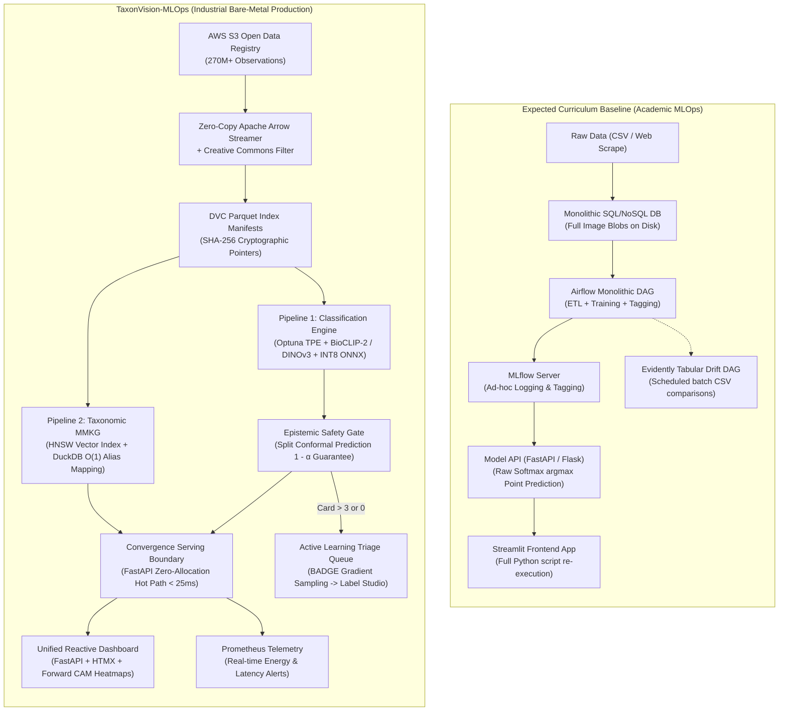
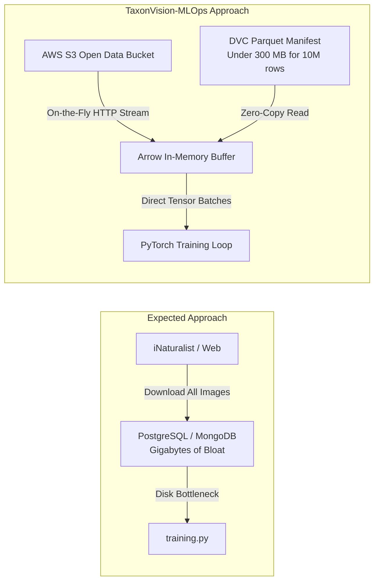
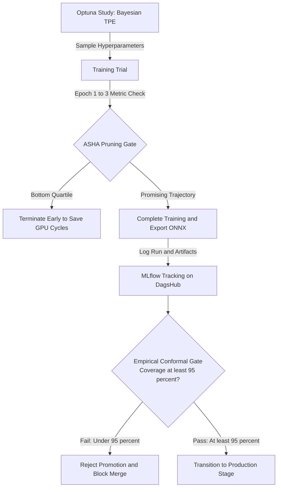
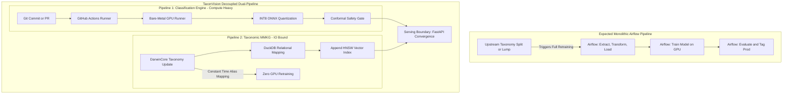
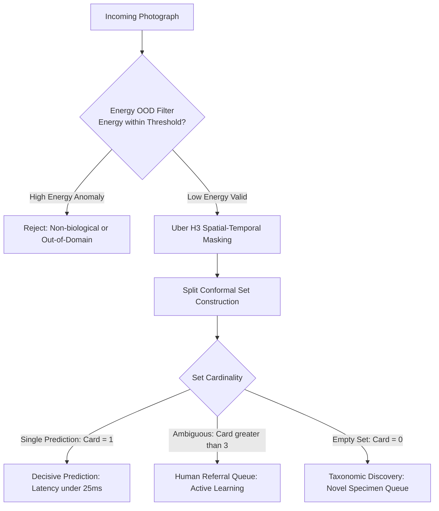

# Curriculum Baseline vs. TaxonVision-MLOps Architecture

This document provides a systematic, step-by-step comparative evaluation between the standard academic MLOps roadmap (as outlined in the course syllabus, project roadmap, and architecture diagrams) and the production-grade architecture engineered in **TaxonVision-MLOps**.

---

## 1. Executive Comparison Matrix

The table below summarizes the key architectural dimensions across both paradigms:

| Architectural Dimension | Expected Curriculum Baseline | TaxonVision-MLOps Production Engine | Comparative Evaluation & Trade-off |
| :--- | :--- | :--- | :--- |
| **Data Ingestion & Storage** | Store images/metadata in local SQL/NoSQL database via a one-time script. | Zero-copy Apache Arrow streaming directly from AWS S3 Open Data; lightweight Parquet manifests. | **TaxonVision is strictly superior.** Circumvents the 50 TB storage trap; avoids database bloat and disk exhaustion. |
| **Open Licensing & Lineage** | Mentioned in passing; rarely enforced at the network edge. | Cryptographic filtering at the edge (CC0, CC-BY, CC-BY-NC); full attribution retention. | **TaxonVision is strictly superior.** Enforces legal compliance for scientific publication and biodiversity portals. |
| **Model Architecture** | Standard frozen ResNet or MobileNet with basic cross-entropy loss. | Timm Backbone Factory (BioCLIP-2, DINOv3, DINOv2, MobileNetV4) with Class-Balanced Loss. | **TaxonVision is strictly superior.** Addresses severe long-tail imbalance where rare taxa have <5 images. |
| **Hyperparameter Tuning** | Ad-hoc manual parameters or simple grid search loops. | Bayesian Optimization via Optuna (TPE) with ASHA early stopping pruned runs. | **TaxonVision is strictly superior.** Maximizes hardware efficiency by terminating unpromising trials in initial epochs. |
| **Experiment Tracking** | Standalone local MLflow instance via `docker-compose`. | Unified DagsHub management plane binding Git commits, DVC hashes, and nested Optuna trials. | **TaxonVision is strictly superior.** Eliminates DevOps overhead of self-hosting Postgres/S3/MLflow servers. |
| **Pipeline Orchestration** | Monolithic Airflow DAG scheduling ETL, training, and production model tagging. | Decoupled Dual-Pipeline: Git-triggered CI/CD for model weights; I/O-bound pipeline for taxonomic MMKG. | **Nuanced Trade-off.** Airflow fits multi-team corporate batch ETL; Dual-Pipeline prevents GPU starvation and decouples taxonomic mutations. |
| **Inference Runtime** | Native unoptimized PyTorch forward pass in Python runtime (often exceeding 100-200 ms on CPU). | Statically quantized INT8 ONNX Runtime engine with pre-allocated buffers (sub-25 ms p95 latency budget). | **TaxonVision is strictly superior.** Zero memory allocation on hot path; 75% parameter footprint reduction. |
| **Uncertainty Quantification** | Uncalibrated softmax probability confidence threshold (`prob > 0.8`). | Split Conformal Prediction with distribution-free coverage guarantee ($1 - \alpha$). | **TaxonVision is strictly superior.** Replaces overconfident softmax misclassifications with statistically guaranteed prediction sets. |
| **Out-of-Distribution (OOD)** | Untreated; assumes all incoming images are valid organisms. | Helmholtz Energy-Based OOD filtering + Uber H3 spatial-temporal seasonal masking. | **TaxonVision is strictly superior.** Prevents nonsensical classifications on blank foliage, mechanical objects, or out-of-range species. |
| **Drift Monitoring** | Batch Evidently reports comparing historical and recent CSVs in Airflow. | Real-time Prometheus metrics scraping + latent embedding drift + Energy score monitoring. | **TaxonVision is strictly superior.** Tabular CSV statistics are blind to visual covariate shifts in high-dimensional image manifolds. |
| **Human-in-the-Loop (HITL)** | Ad-hoc manual inspection or simple error logging. | BADGE (Batch Active Learning by Diverse Gradient Embeddings) with $k$-means++ triage queue. | **TaxonVision is strictly superior.** Maximizes model accuracy gain per unit of expert taxonomic annotation effort. |
| **Serving & User Interface** | Separate Streamlit app calling FastAPI endpoint over HTTP. | Unified FastAPI + Jinja2/HTMX dashboard with forward-hooked visual CAM heatmaps (<5 ms overhead). | **Nuanced Trade-off.** Streamlit offers faster initial 1-file prototypes; HTMX provides sub-millisecond reactive UI with production concurrency. |
| **Development Toolchain** | Ad-hoc `pip`, standard `requirements.txt`, Docker Compose. | Pure Pixi (`.pixi/`) environment with SAT solver, Justfile recipe harness, GPG commit signing. | **TaxonVision is strictly superior.** Eliminates virtualenv corruption; deterministic cross-platform reproducibility. |

---

## 2. Phase-by-Phase Comparative Analysis

### Phase 0: Project Kick-off & Perimeter Formulation

#### Phase 0 Baseline: Interactive Prototyping

* Focuses on understanding the prompt and viewing the kick-off recording.
* Defines a simple classification problem on a small subset of 10 well-represented taxa.
* Relies on naive university/curriculum architectures such as standard exploratory data analysis in monolithic interactive Jupyter notebooks (MLOps Level 0), unversioned local data, random splits, and a complete lack of uncertainty estimates.

#### Phase 0 TaxonVision: Operational Maturity Specifications

* Formulates the complete mathematical, physical, and legal constraints before writing code.
* Replaces naive paradigms with TaxonVision-MLOps architectures guaranteeing data immutability via DVC, zero-copy streaming, Split Conformal prediction coverage guarantees, and zero-open-ports edge ingress topology via Cloudflare Tunnels.
* Defines a formal four-tier operational maturity framework spanning from manual prototypes (Level 0) to Epistemic Safety (Level 4).
* Formulates the long-tail problem: biological biodiversity naturally follows a Pareto distribution where head taxa have tens of thousands of observations while thousands of endangered species have fewer than ten observations.
* Establishes hardware allocation rules: heterogeneous CPU pin-binding (P-cores for gradient math, E-cores for async I/O) on bare-metal workstations.

---

### Phase 1: Foundations (Data Storage, Baseline Model, Basic API)

#### Step 1.1: Data Collection & Storage Topology

##### Baseline Paradigm: Relational or Document DB Storage

* Set up a relational (PostgreSQL) or document (MongoDB) database.
* Write a one-time Python script that queries an external source and stores observations and image files directly into the database or on local disk.

##### TaxonVision Architecture: S3 Arrow Streaming & Parquet

* **Circumventing the 50-Terabyte Storage Trap:** The raw citizen-science corpus on AWS Open Data exceeds 50 Terabytes. Downloading raw imagery into a local database is financially prohibitive and results in disk failure.
* **Zero-Copy Apache Arrow Streaming:** Rather than storing image blobs, [`S3ImageStreamer`](file:///home/benni/Documents/antigravity_workspace/taxon-vision-mlops/src/taxon_vision/data/s3_streamer.py) streams image data directly from the public AWS S3 bucket (`s3://inaturalist-open-data/`) on demand using non-blocking HTTP streaming buffers.
* **Cryptographic Parquet Manifests:** Observation metadata, image URLs, taxon IDs, and attribution headers are indexed into compact Apache Parquet manifests (`data/manifests/dataset_manifest.parquet`). An index of 10 million observations consumes less than 300 MB of disk space.
* **Embedded Analytics Engine:** Replaces heavyweight external database daemons with embedded Polars and DuckDB. Queries execute in-process via vectorized Arrow memory structures with zero serialization overhead.

##### Comparative Verdict & Trade-off: Storage Topology

* *Storage Efficiency:* Zero local image storage required; 518 observations consume only 10.7 KB of manifest storage instead of gigabytes of raw images.
* *DevOps Overhead:* Zero database daemons to configure, patch, or maintain.
* *The Trade-off:* Streaming requires consistent network connectivity during training batches. If internet access is intermittent, a local cache of reference exemplar crops (strictly capped at 50 crops per species, consuming ~4.5 GB) acts as a fallback buffer.

---

#### Step 1.2: Open Licensing & Legal Compliance

##### Baseline Paradigm: Passive Licensing Awareness

* Mentions open licensing as a side note in documentation without programmatic enforcement.

##### TaxonVision Architecture: Programmatic License Filtering

* Enforces strict programmatic license filtering at the ingestion edge via [`license_filter.py`](file:///home/benni/Documents/antigravity_workspace/taxon-vision-mlops/src/taxon_vision/data/license_filter.py).
* Adheres to Project Mandate `05-open-license-compliance.md`: only observations licensed under **CC0**, **CC-BY**, or **CC-BY-NC** are admitted. Restrictive or static-domain assets without open licenses are rejected immediately.
* Preserves attribution lineage: photographer names and license URLs are embedded alongside taxon identifiers in the Parquet manifest, ensuring full attribution retention during model training and inference.

---

#### Step 1.3: Baseline Model Architecture & Imbalance Formulation

##### Baseline Paradigm: Standard Cross-Entropy Training

* Implement two standalone Python scripts (`training.py` and `predict.py`).
* Fine-tune a frozen convolutional network (e.g., standard ResNet-50 or MobileNetV2) using standard Cross-Entropy loss:

$$\mathcal{L}_{\text{CE}} = - \sum_{i=1}^{K} y_i \log(\hat{p}_i)$$

##### TaxonVision Architecture: Foundation Factory & Class-Balanced Loss

* **Foundation Backbone Factory:** Supports state-of-the-art vision models via Timm, including **BioCLIP-2** (trained on biological taxonomy), **DINOv3**, **DINOv2**, and **MobileNetV4**.
* **Class-Balanced Loss:** Standard cross-entropy collapses on biological datasets due to extreme class imbalance. TaxonVision applies Class-Balanced Loss (Cui et al., 2019), which introduces a weighting factor based on the effective number of samples $E_n$:

$$E_n = \frac{1 - \beta^n}{1 - \beta}, \quad \text{where } \beta = \frac{N - 1}{N}$$

The class-balanced cross-entropy loss is formulated as:

$$\mathcal{L}_{\text{CB}}(p, y) = - \frac{1 - \beta}{1 - \beta^{n_y}} \log(\hat{p}_y)$$

Where $n_y$ is the number of ground-truth samples for class $y$. This prevents common species (head) from dominating gradients over rare species (tail).

##### Comparative Verdict & Trade-off: Loss Functions

* Standard cross-entropy achieves high top-1 accuracy on common birds or plants while completely failing on rare species. Class-Balanced loss guarantees fair gradient updates across all taxa.

---

#### Step 1.4: Basic Inference API

##### Baseline Paradigm: Raw Softmax Endpoints

* A basic Flask or FastAPI server exposing `/training` and `/predict` endpoints.
* Returns raw softmax argmax predictions (`{"prediction": "Bombus ternarius", "confidence": 0.89}`).

##### TaxonVision Architecture: Sub-25ms Unified Service

* **Unified Service:** FastAPI powers both the machine REST API and the server-rendered interactive HTMX dashboard.
* **Low-Latency Engine:** Inference executes via ONNX Runtime with INT8 quantization, enforcing a strict p95 latency budget under 25 ms.
* **Epistemic Safety:** Never returns uncalibrated softmax scores. Predictions pass through out-of-distribution energy detection and Split Conformal Prediction sets before reaching the client.

---

### Phase 2: Microservices, Tracking, Versioning & Orchestration

#### Step 2.1: Experiment Tracking & Hyperparameter Optimization

##### Baseline Paradigm: Ad-Hoc MLflow Logging

* Add basic `mlflow.log_param()` and `mlflow.log_metric()` calls inside `training.py`.
* Compare metrics manually or via script, tagging the latest model as production if accuracy improves.

##### TaxonVision Architecture: Bayesian Optuna & Statistical Model Registry Gate

* **Bayesian Optimization Interlock:** Couples Optuna's Tree-structured Parzen Estimator (TPE) with MLflow. Instead of manual trial-and-error, TPE models parameter distributions conditioned on historical loss:

$$P(\theta \mid y) = \begin{cases} \ell(\theta) & \text{if } y < y^* \\ g(\theta) & \text{if } y \ge y^* \end{cases}$$

* **ASHA Early Pruning:** Asynchronous Successive Halving Algorithm automatically prunes unpromising trials in early epochs, freeing GPU cycles.
* **Automated Safety Gate:** Models cannot be tagged as production based on raw accuracy alone. Candidate checkpoints must pass an empirical conformal coverage verification ($Coverage \ge 1 - \alpha$) on a holdout calibration split before automated stage transition in the registry.

---

#### Step 2.2: Pipeline Orchestration & Architecture Decoupling

##### Baseline Paradigm: Monolithic Airflow DAG & Docker-Compose

* Monolithic Airflow DAG orchestrating ETL, model training, evaluation, and tagging on a scheduled basis (as illustrated in `docs/.archive/predict_pipeline.png`).
* Microservices packaged with `docker-compose` running Airflow Webserver, Scheduler, Postgres, Redis, Celery Worker, MLflow Server, and API.

##### TaxonVision Architecture: Asymmetric Dual-Pipeline Topology

A fundamental anti-pattern in MLOps is coupling weight-centric neural training with data-centric biological indexing into a single monolithic DAG. TaxonVision physically isolates these pipelines:

* **Pipeline 1 (The Classification Engine):** Weight-centric, compute-heavy, executed on bare-metal GPU (NVIDIA RTX 5070 Ti) via Git-triggered CI/CD. Runs occasionally (weeks/months) when backbone architectures or hyperparameter spaces are refined.
* **Pipeline 2 (The Taxonomic MMKG):** Data-centric, I/O-bound. Biological taxonomies mutate frequently: species are split into separate taxa or lumped together under unified nomenclature. Pipeline 2 updates the Hierarchical Navigable Small World (HNSW) vector index and executes $O(1)$ relational alias mapping in DuckDB without retraining the neural network or re-computing image embeddings.

##### Comparative Verdict & Trade-off: Airflow vs. Dual-Pipeline

* *Resource Starvation:* A local `docker-compose` cluster running Airflow Webserver, Scheduler, Postgres, Redis, and workers requires 4 to 8 GB of RAM just at idle. On developer laptops or constrained edge servers, this leaves inadequate memory for model training or low-latency ONNX execution.
* *Taxonomic Volatility:* In biodiversity science, biological renaming happens continuously. In a monolithic Airflow pipeline, every taxonomy change triggers a full model retrain. In TaxonVision, taxonomic lumps and splits are resolved in $O(1)$ time in DuckDB without re-embedding a single image.
* *When Airflow is Appropriate:* For large enterprises with dedicated data engineering teams orchestrating heterogeneous cross-departmental SQL data warehouses, Airflow is an industry standard. For specialized Vision MLOps on modern silicon, containerized Airflow is unnecessarily heavy and introduces architectural drag.

---

#### Step 2.3: Cryptographic Data Versioning

##### Baseline Paradigm: Standalone DVC without Git

* "Use DVC (without Git) to version datasets and store their hashes in MLflow."

##### TaxonVision Architecture: Cryptographic Git-DVC Content-Addressable Storage

* **Cryptographic Git-DVC Interlock:** Rejects "DVC without Git". Git tracks code and lightweight DVC pointer files (`.dvc`), while DVC tracks content-addressable binary blobs via SHA-256 hashes.
* **Storage Economics:** DagsHub provides a 20 GB free-tier S3 remote. TaxonVision's bounded storage budget (Parquet manifests + 50 exemplar crops per species + ONNX models) peaks at ~8.3 GB, leaving 60% buffer space without incurring cloud egress fees.

---

#### Step 2.4: CI/CD, Code Quality & Git Security

##### Baseline Paradigm: Optional Basic CI Tests

* Optional unit tests; simple `ci.yaml` running basic tests on master.

##### TaxonVision Architecture: Enforced Quality Gates & Signed Commits

* **Mandatory Pre-Commit Gates:** Every commit must pass Ruff linting, Ruff formatting, strict MyPy type checking, license compliance auditing, and OKF frontmatter validation.
* **Cryptographic Commit Signing:** All local commits must be SSH/GPG signed (`git commit -S`), enforcing software supply chain security.
* **Lightweight Local CI Harness:** `just ci` executes linting, unit tests, and documentation builds locally on CPU in ~15 seconds without Docker daemon overhead.
* **Scientific Test Fixtures:** Unit tests utilize deterministic synthetic mocks and standardized biological benchmarks (CUB-200 / Oxford Flowers) to verify mathematical coverage and classification heads.

---

### Phase 3: Monitoring, Maintenance & Operational Safety

#### Step 3.1: Epistemic Safety & Split Conformal Prediction

##### Baseline Paradigm: Uncalibrated Softmax Heuristic

* Relies on uncalibrated softmax probability outputs:

$$\hat{p}_k = \frac{\exp(z_k)}{\sum_j \exp(z_j)}$$

If $\max_k \hat{p}_k \ge 0.8$, the model accepts the prediction; otherwise, it reports low confidence.

##### TaxonVision Architecture: Distribution-Free Split Conformal Prediction

* **The Failure Mode of Softmax:** Softmax normalizes logits across classes, forcing probabilities to sum to 1. On out-of-domain images, corrupted inputs, or novel species, softmax frequently produces overconfident point predictions with spurious certainty on incorrect classes.
* **Split Conformal Prediction Theory:** The serving engine implements distribution-free Split Conformal Prediction (Angelopoulos & Bates, 2021). On an independent calibration split $\mathcal{D}_{\text{cal}} = \{(x_i, y_i)\}_{i=1}^n$, non-conformity scores are computed:

$$s_i = 1 - \hat{\pi}_{y_i}(x_i)$$

Given a user-specified significance level $\alpha \in (0, 1)$ (e.g., $\alpha = 0.05$ for $95\%$ coverage), the system calculates the empirical quantile threshold $\hat{q}_\alpha$:

$$\hat{q}_\alpha = \text{Quantile}\left(\{s_1, \dots, s_n\}; \, \frac{\lceil (n+1)(1-\alpha) \rceil}{n}\right)$$

For an unseen query photograph $X_{n+1}$, the prediction set $\hat{C}(X_{n+1})$ includes all candidate taxa satisfying:

$$\hat{C}(X_{n+1}) = \left\{ y \in \{1, \dots, K\} : \hat{\pi}_y(X_{n+1}) \ge 1 - \hat{q}_\alpha \right\}$$

This mathematically guarantees marginal coverage:

$$P\left(Y_{n+1} \in \hat{C}(X_{n+1})\right) \ge 1 - \alpha$$

* **Triage Routing Logic:**
    * $|C| = 1$: Decisive identification. Returned instantly to the user (<25 ms).
    * $|C| > 3$: Ambiguous prediction. Diverted to human review queue.
    * $|C| = 0$: Novel taxon or severe anomaly. Routed directly to taxonomic specialists.

---

#### Step 3.2: Out-of-Distribution Detection & Spatial Masking

##### Baseline Paradigm: Assumption of In-Distribution Inputs

* Not addressed in the curriculum baseline. Assumes all incoming images belong to known categories.

##### TaxonVision Architecture: Helmholtz Energy OOD & H3 Spatial Masking

* **Helmholtz Energy-Based OOD Detection:** Evaluates free energy directly from logits:

$$E(x; f) = -T \cdot \log \sum_{j=1}^{K} \exp\left(\frac{f_j(x)}{T}\right)$$

Observations with energy scores exceeding an empirically tuned threshold $\tau_{\text{OOD}}$ are rejected immediately, filtering empty foliage, background clutter, and corrupt images before running point classification.

* **Uber H3 Spatial-Temporal Constraint Masking:** Integrates DarwinCore coordinates and observation month. If a species has never been observed within a geodesic radius of spatial cell $h$ during seasonal window $m \pm 1$, its logit is masked to $-\infty$ ($\tilde{f}_j = -\infty$), ensuring geographically impossible species are pruned before uncertainty sets are constructed.

---

#### Step 3.3: Drift Detection & Observability

##### Baseline Paradigm: Scheduled Batch Evidently Reports

* Scheduled Airflow DAG running Evidently AI on tabular CSV dumps of recent predictions vs. historical baseline data.
* Webhook trigger from Grafana to retrain when an alert fires.

##### TaxonVision Architecture: Real-Time Prometheus Metrics & Manifold Drift

* **The Failure of Tabular Drift on Imagery:** Running Evidently Kolmogorov-Smirnov tests on raw pixel values or softmax probabilities is ineffective for computer vision. Concept drift in vision manifests in feature representation manifolds, not independent 1D column distributions.
* **Real-Time Prometheus Telemetry:** Exposes Prometheus metrics via `/metrics`:
    * `inference_latency_seconds_bucket` (p95 / p99 histograms)
    * `conformal_prediction_set_size` (cardinality distributions)
    * `ood_energy_score` (free energy shifts)
* **Representation Drift:** Monitors cosine distance drift and Maximum Mean Discrepancy (MMD) across penultimate feature embeddings.
* **Grafana Alerting:** Automated alerts trigger GitHub Actions webhook runners when mean conformal set size expands (indicating distribution shift) or OOD rejection rates spike.

---

#### Step 3.4: Active Learning & Human-in-the-Loop (HITL)

##### Baseline Paradigm: Passive Human Inspection

* Collect user predictions in a database; periodic manual inspection.

##### TaxonVision Architecture: BADGE Gradient Active Learning & Label Studio

* **BADGE Query Strategy:** Implements Batch Active Learning by Diverse Gradient Embeddings (Ash et al., 2020). For candidate unannotated observations, it computes loss gradients with respect to the final linear layer parameters:

$$g_x = \nabla_{\theta_{\text{last}}} \mathcal{L}(f(x; \theta), \hat{y})$$

* **$k$-Means++ Seeding:** Selects a diverse batch of high-uncertainty observations in gradient embedding space.
* **Label Studio Synchronization:** Triage queues sync directly to a managed DagsHub Label Studio workspace. Validated labels automatically feed back into DVC-versioned training manifests, closing the continuous active learning loop.

---

#### Step 3.5: User Interface & Visual Explainability

##### Baseline Paradigm: Standalone Streamlit Application

* Separate Streamlit application communicating with the backend API.
* Displays top prediction, confidence bar chart, and sample image.

##### TaxonVision Architecture: Unified FastAPI + HTMX & Forward-Hooked CAM

* **Unified FastAPI + Jinja2 + HTMX:** Eliminates the architectural friction of running a secondary Streamlit container. Server-rendered HTMX provides instantaneous DOM swapping with low latency and native concurrency.
* **Forward-Hooked Class Activation Mapping (CAM):** While modern extensions like Grad-CAM are popular, they require a backward pass (backpropagation) during inference, which violates low-latency SLAs (<25 ms) and is incompatible with forward-only INT8 ONNX runtimes. TaxonVision intercepts the spatial feature maps $A^k$ and static classification weights $w_k^c$ during the forward pass:

$$L_{\text{CAM}}^c = \text{ReLU}\left(\sum_k w_k^c A^k\right)$$

Synthesizes high-fidelity anatomical heatmaps with minimal forward-pass overhead (targeted under 2 to 5 ms) and zero backward passes.

##### Comparative Verdict & Trade-off: Streamlit vs. FastAPI/HTMX

* *Streamlit Strengths:* Exceptional for rapid 1-hour prototyping where data scientists write quick Python scripts with sliders and charts.
* *Streamlit Weaknesses:* Re-executes the entire Python script on every widget interaction; stores user state in server memory; high latency; incapable of serving production REST endpoints.
* *FastAPI + HTMX Strengths:* Production-grade concurrency; clean separation of machine REST API and human dashboard; sub-millisecond DOM updates; responsive mobile-friendly interface.

---

## 3. Summary of Architectural Advantages

* **Storage Independence:** Resolves the 50 TB citizen-science data challenge through zero-copy Arrow streaming and DVC Parquet manifests (<11 KB local footprint vs. database bloat).
* **Mathematical Epistemic Safety:** Replaces uncalibrated softmax point guesses with distribution-free Split Conformal Prediction ($1 - \alpha$ coverage guarantee).
* **Decoupled Dual-Pipeline:** Isolates compute-heavy GPU weight updates from high-velocity taxonomic schema realignments, achieving $O(1)$ taxonomy updates.
* **Sub-25ms Latency SLA:** Combines INT8 static ONNX PTQ, zero-allocation memory paths, and forward-hooked visual CAM.
* **Intelligent Active Learning:** Deploys BADGE gradient embeddings to maximize taxonomic model improvement per unit of human verification effort.
* **Robust Toolchain:** Replaces brittle virtual environments with Pixi, Justfile recipes, and cryptographic commit signing.
