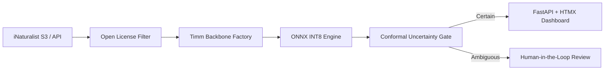

# TaxonVision-MLOps Platform Overview

TaxonVision-MLOps is an automated, end-to-end machine learning operations pipeline and production service designed for species identification from citizen-science photographs.

## System Tenets

* **Production Chain Over Notebook Glory:** A simple, versioned, monitored, deployed, and automatically retrainable model is infinitely better than an isolated notebook model.
* **Mathematical Safety Invariants:** Predictions are accompanied by distribution-free **Split Conformal Prediction** sets guaranteeing a user-specified error rate ($1 - \alpha$).
* **Open Licensing & Attribution:** Adheres to DarwinCore and Creative Commons standards, strictly filtering open licenses and preserving photographer attribution.
