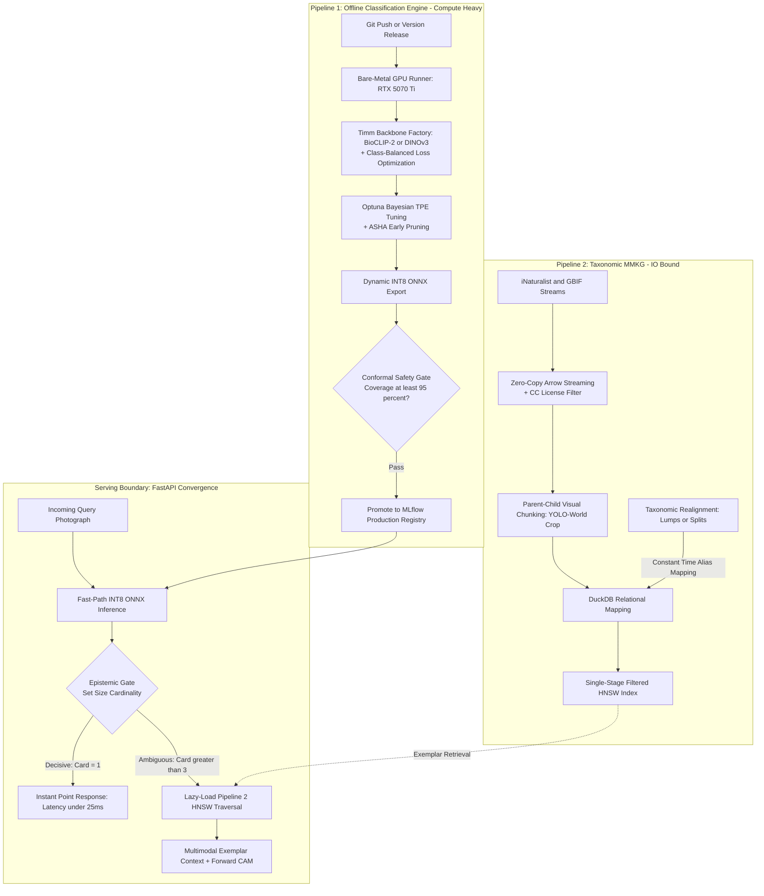
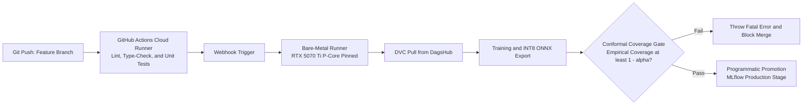

# Asymmetric Dual-Pipeline Architecture

A common failure mode in machine learning engineering is the monolithic pipeline, where neural network training sequences and data indexing tasks are tightly coupled into a single execution graph. TaxonVision-MLOps explicitly rejects this monolithic model. Instead, it establishes an **asymmetric dual-pipeline topology** that decouples the weight-centric classification engine from the data-centric taxonomic Multimodal Knowledge Graph (MMKG).



---

## 1. Asymmetric Execution Decoupling

The necessity for architectural decoupling stems directly from the fundamentally asymmetric cadence of biological modeling operations:

* **Pipeline 1 (The Classification Engine):** The Training Pipeline runs asynchronous batch GPU training. The neural backbone (e.g., BioCLIP-2 or DINOv3 transformer) is computationally expensive to train but relatively static once deployed. Optimizing its weights via Class-Balanced Loss requires intensive GPU Tensor Core utilization, distributed gradient synchronization, and static ONNX Post-Training Quantization (PTQ) calibration. Once a verified checkpoint is produced, this model may remain stable in production for weeks or months.
* **Pipeline 2 (The Taxonomic MMKG):** The Inference Serving Pipeline provides sub-50ms CPU/GPU edge serving. In contrast, the underlying citizen-science stream is highly volatile. Biological taxonomies undergo frequent scientific realignments where species are split into novel branches or lumped under unified nomenclature. Pipeline 2 is an I/O-bound vector-indexing workflow responsible for parsing DarwinCore Parquet manifests, extracting zero-shot organism crops, filtering open licenses, and maintaining the Hierarchical Navigable Small World (HNSW) graph.

Forcing Pipeline 1 to re-execute a heavy neural network training sweep merely because an upstream provider updated an exemplar image or revised a taxonomic name wastes substantial GPU compute. Decoupling these domains guarantees **failure isolation**: if a malformed DarwinCore archive introduces a schema violation, Pipeline 2 halts safely while Pipeline 1 continues serving classifications.

---

## 2. Automated CI/CD Orchestration and Model Promotion

The lifecycle of Pipeline 1 is strictly governed by Continuous Integration and Continuous Deployment (CI/CD) interlocks:



### Cryptographic Provenance Binding

As training initializes, the pipeline binds the active MLflow run directly to the Git commit SHA that triggered execution:

```python
mlflow.set_tag("git.commit", os.environ.get("GITHUB_SHA"))
```

This guarantees absolute cryptographic lineage connecting source code, DVC data hashes, and compiled ONNX model weights.

### The Conformal Safety Gate

Before any candidate model enters the production registry, an automated evaluation verifies the candidate ONNX graph against a holdout calibration dataset $\mathcal{D}_{\text{cal}}$. The gate formally asserts that the empirical marginal coverage of the Split Conformal Prediction set satisfies the mathematical bound:

$$\text{Coverage}_{\text{empirical}} = \frac{1}{n} \sum_{i=1}^{n} \mathbb{I}\left(y_i \in \hat{C}(x_i)\right) \ge 1 - \alpha$$

If empirical coverage falls below $1 - \alpha$ (e.g., $95\%$ when $\alpha = 0.05$), the assertion fails, terminating the runner and preventing the uncalibrated model from reaching production.

---

## 3. Convergence at the Serving Boundary

The two independent pipelines converge exclusively at the serving boundary managed by FastAPI:

* **Fast-Path Inference:** When a query photograph arrives, it is processed through the pre-loaded INT8 ONNX backbone from Pipeline 1.
* **Decisive Predictions ($|C| = 1$):** If the conformal prediction set contains exactly one candidate, the identification is returned immediately. The vector database is bypassed, achieving sub-25 ms latency.
* **Conformal-Driven Lazy Execution ($|C| > 3$):** If the model detects severe ambiguity, the serving engine lazy-loads the HNSW index from Pipeline 2, executes a single-stage filtered traversal, and retrieves top-$k$ reference exemplar crops to synthesize comparative context.

---

## 4. Forward-Hooked Class Activation Mapping (CAM)

Providing diagnostic transparency to human reviewers requires visual interpretability without violating strict latency SLAs. While modern extensions like Grad-CAM are popular, they require a backward pass (gradient backpropagation), which destroys low-latency serving and is incompatible with forward-only INT8 ONNX runtimes. We instead utilize standard Class Activation Mapping (CAM).

TaxonVision bypasses backpropagation by intercepting the spatial feature maps $A^k$ emitted by the final convolutional or attention layer before global average pooling. Because the classification head is a linear layer, the importance weight $w_k^c$ of feature channel $k$ for class $c$ is directly extracted from the static weight matrix:

$$L_{\text{CAM}}^c = \text{ReLU}\left(\sum_{k} w_k^c A^k\right)$$

Where:

* $L_{\text{CAM}}^c$ is the resulting two-dimensional activation heatmap for class $c$, bilinearly upsampled to the original image dimensions.
* $A^k$ is the $k$-th channel of the spatial feature map tensor extracted during the standard forward pass.
* $w_k^c$ is the static linear layer weight connecting feature channel $k$ to the class logit.
* $\text{ReLU}$ discards negative spatial influences, highlighting only the pixels that positively contributed to class $c$.

This forward-only calculation executes in **under 2 milliseconds**, generating high-fidelity morphological heatmaps without GPU backpropagation.
