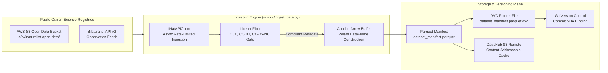

# Ingestion Engine & Cryptographic Versioning

Processing planetary-scale citizen-science data streams requires strict cryptographic reproducibility, legal compliance safeguards, and resource-bounded storage strategies right at the network boundary.



---

## 1. Data Topography & Open-Access Mandates

Global biodiversity portals aggregate continuous streams of species observations:

* **Ecosystem Scale:** Combined registries (iNaturalist and GBIF) host over 270 million raw observations, with approximately 170 million having achieved research-grade consensus status.
* **API Ingestion Caps:** Direct API consumption is throttled to 60 requests per minute, with a download cap of 5 GB per hour and 24 GB per day.
* **Strict Open Licensing:** Only observations explicitly released under open licenses are admitted into the pipeline. Assets on static domains without verified licenses are rejected.

### Programmatic License Filtering

Incoming observation records pass through [`LicenseFilter`](file:///home/benni/Documents/antigravity_workspace/taxon-vision-mlops/src/taxon_vision/data/license_filter.py#L19), evaluating metadata against permitted Creative Commons licenses:

* **Permitted:** `CC0` (Public Domain Dedication), `CC-BY` (Attribution), and `CC-BY-NC` (Attribution-NonCommercial).
* **Rejected:** Commercial or restrictive variants (`CC-BY-ND`, `CC-BY-SA`, all-rights-reserved copyright) are discarded at the edge.
* **Attribution Retention:** Every ingested observation retains its photographer credit, license code, and observation GUID, serialized directly into downstream Parquet tables to ensure scientific traceability.

---

## 2. Circumventing the 50-Terabyte Storage Trap

The raw citizen-science image dataset hosted on AWS Open Data exceeds 50 Terabytes. Downloading and duplicating this volume locally would cause immediate storage exhaustion.

TaxonVision circumvents this trap via **zero-duplication streaming**:

* **Zero-Copy Arrow Buffers:** [`S3ImageStreamer`](file:///home/benni/Documents/antigravity_workspace/taxon-vision-mlops/src/taxon_vision/data/s3_streamer.py#L16) streams image objects directly from the public AWS S3 bucket into memory during training.
* **Lightweight Parquet Manifests:** The local repository stores only cryptographically validated Parquet index files containing observation IDs, taxon IDs, source URLs, and attribution headers.
* **Storage Footprint:** An index representing 10 million biological observations occupies less than 300 MB of disk space.

---

## 3. Bounded Exemplar Storage Mathematics

For visual retrieval in the taxonomic MMKG, the system maintains a curated **Reference Exemplar Catalogue**, strictly capped at 50 validated environmental crops per taxon:

$$N_{\text{total}} = 2{,}000 \text{ baseline taxa} \times 50 \text{ crops} = 100{,}000 \text{ exemplar crops}$$

Assuming compressed WebP images averaging 45 KB per crop (with an upper bound of 60 KB), the storage footprint evaluates to:

$$\text{Storage}_{\text{Exemplars}} = 100{,}000 \times 45 \text{ KB} = 4{,}500{,}000 \text{ KB} \approx 4.5 \text{ GB}$$

Accounting for manifests, statically calibrated INT8 ONNX checkpoints, and DVC churn:

$$\text{Storage}_{\text{Total}} = 0.3 \text{ GB (Manifests)} + 4.5 \text{ GB (Exemplars)} + 2.0 \text{ GB (ONNX)} + 1.5 \text{ GB (DVC Churn)} \approx 8.3 \text{ GB}$$

This 8.3 GB allocation consumes less than **$50\%$ of DagsHub's 20 GB free-tier storage quota**, entirely eliminating cloud storage egress costs.

---

## 4. DVC Pipeline Topology & DagsHub Remote Storage

Data Version Control (DVC) and DagsHub establish the data management control plane for TaxonVision, combining cloud-backed content-addressable storage with deterministic pipeline DAG execution.

### 4.1 Remote Architecture & DagsHub S3 Integration

DagsHub provisions a unified cloud control plane that mirrors the primary GitHub repository and hosts an S3-compatible content-addressable storage bucket:

* **Remote Endpoint Configuration:** The repository connects to DagsHub via `.dvc/config` targeting `s3://dvc` at `https://dagshub.com/foersben/taxon-vision-mlops.s3`.
* **Zero-Egress Data Archival:** Binary Parquet manifests, exemplar crops, and quantized model artifacts are pushed directly to this remote endpoint (`dvc push`), preventing Git LFS size bottlenecks and repository bloat.
* **Unified Management Plane:** Alongside DVC remote caching, DagsHub hosts the centralized MLflow Tracking Server and experiment dashboard, linking Git commit SHAs, DVC dataset versions, and training run metrics within a single interface.

### 4.2 Pipeline DAG Specification (`dvc.yaml` & `dvc.lock`)

Rather than relying on isolated shell scripts, data processing workflows are structured as a formal Directed Acyclic Graph (DAG) declared in [dvc.yaml](file:///home/benni/Documents/antigravity_workspace/taxon-vision-mlops/dvc.yaml):

```yaml
stages:
  ingestion:
    cmd: pixi run --frozen -e dev python scripts/ingest_data.py
    deps:
      - scripts/ingest_data.py
      - src/taxon_vision/data/inat_client.py
      - src/taxon_vision/data/license_filter.py
    params:
      - config/params.yaml:
        - ingestion.taxa_to_fetch
        - ingestion.per_page
    outs:
      - data/manifests
```

The pipeline topology enforces cryptographic lineage across three elements:

* **Inputs and Dependencies (`deps`):** Source scripts and library modules responsible for observation retrieval and validation.
* **Configuration Parameters (`params`):** Parameter subsets in `config/params.yaml` defining target taxon IDs and ingestion volume.
* **Outputs (`outs`):** Destination directories containing generated dataset manifests (`data/manifests`), tracked by content hashes in [dvc.lock](file:///home/benni/Documents/antigravity_workspace/taxon-vision-mlops/dvc.lock).

### 4.3 Why DVC Tracks Code Dependencies

A primary design principle of DVC is that it does not duplicate Git's responsibilities, but extends them to maintain mathematical data-to-code lineage:

* **Separation of Responsibilities:**
    * Git manages source code revision history, file diffs, branches, and author identity.
    * DVC does not version or store source code copies. Instead, it computes and records cryptographic MD5 checksums over designated source files inside `dvc.lock`.
* **Code-to-Data Lineage Guarantee:**
    * A dataset manifest (`data/manifests/dataset_manifest.parquet`) is the deterministic mathematical output of the ingestion code executed against external API inputs.
    * If the HTTP query logic in `inat_client.py` changes, or if the license acceptance rules in `license_filter.py` are altered, the downstream dataset is no longer valid for that pipeline state.
    * Tracking code modules as stage dependencies guarantees that modifications to transformation logic immediately invalidate the cached stage output.

### 4.4 Status Evaluation & Lifecycle Semantics

When developers modify source files declared in the `deps` block, DVC detects hash discrepancies between the active filesystem and the recorded state in `dvc.lock`:

```text
ingestion:
    changed deps:
        modified: src/taxon_vision/data/inat_client.py
        modified: src/taxon_vision/data/license_filter.py
```

This diagnostic indicates that the pipeline DAG has entered an unverified state:

* **Stage Reproduction (`dvc repro`):**
    * Re-executes the ingestion command, runs the updated client and filter logic, produces a fresh `data/manifests` directory, and writes updated dependency and output hashes into `dvc.lock`.
    * Utilized when code changes intentionally modify data ingestion semantics or filtering rules.
* **Checksum Synchronization (`dvc commit`):**
    * Updates the MD5 checksums of the modified source files in `dvc.lock` without re-running the ingestion command or overwriting existing manifests.
    * Utilized when source modifications are cosmetic or structural (such as type annotations, docstrings, or logging tweaks) that do not alter the underlying data output.

---

## 5. Filesystem Determinism: BTRFS NOCOW Subvolumes

Under continuous local dataset writes and DVC caching, Copy-on-Write (CoW) filesystems such as BTRFS suffer severe block fragmentation.

To ensure deterministic read bandwidth across the NVMe bus, local data caches are mounted on a dedicated subvolume configured with the NOCOW attribute (`chattr +C`), guaranteeing contiguous physical block allocations during multi-gigabyte training streams.
