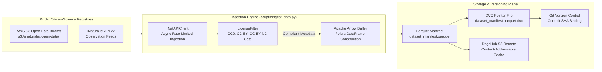

# Ingestion Engine & Cryptographic Versioning

Processing planetary-scale citizen-science data streams requires strict cryptographic reproducibility, legal compliance safeguards, and resource-bounded storage strategies right at the network boundary.



---

## 1. Data Topography & Open-Access Mandates

Global biodiversity portals aggregate continuous streams of species observations:

* **Ecosystem Scale:** Combined registries (iNaturalist and GBIF) host over 270 million raw observations, with approximately 170 million having achieved research-grade consensus status.
* **API Ingestion Caps:** Direct API consumption is throttled to 60 requests per minute, with a download cap of 5 GB per hour and 24 GB per day.
* **Strict Open Licensing:** Only observations explicitly released under open licenses are admitted into the pipeline. Assets on static domains without verified licenses are rejected.

### Programmatic License Filtering

Incoming observation records pass through [`LicenseFilter`](file:///home/benni/Documents/antigravity_workspace/taxon-vision-mlops/src/taxon_vision/data/license_filter.py#L19), evaluating metadata against permitted Creative Commons licenses:

* **Permitted:** `CC0` (Public Domain Dedication), `CC-BY` (Attribution), and `CC-BY-NC` (Attribution-NonCommercial).
* **Rejected:** Commercial or restrictive variants (`CC-BY-ND`, `CC-BY-SA`, all-rights-reserved copyright) are discarded at the edge.
* **Attribution Retention:** Every ingested observation retains its photographer credit, license code, and observation GUID, serialized directly into downstream Parquet tables to ensure scientific traceability.

---

## 2. Circumventing the 50-Terabyte Storage Trap

The raw citizen-science image dataset hosted on AWS Open Data exceeds 50 Terabytes. Downloading and duplicating this volume locally would cause immediate storage exhaustion.

TaxonVision circumvents this trap via **zero-duplication streaming**:

* **Zero-Copy Arrow Buffers:** [`S3ImageStreamer`](file:///home/benni/Documents/antigravity_workspace/taxon-vision-mlops/src/taxon_vision/data/s3_streamer.py#L16) streams image objects directly from the public AWS S3 bucket into memory during training.
* **Lightweight Parquet Manifests:** The local repository stores only cryptographically validated Parquet index files containing observation IDs, taxon IDs, source URLs, and attribution headers.
* **Storage Footprint:** An index representing 10 million biological observations occupies less than 300 MB of disk space.

---

## 3. Bounded Exemplar Storage Mathematics

For visual retrieval in the taxonomic MMKG, the system maintains a curated **Reference Exemplar Catalogue**, strictly capped at 50 validated environmental crops per taxon:

$$N_{\text{total}} = 2{,}000 \text{ baseline taxa} \times 50 \text{ crops} = 100{,}000 \text{ exemplar crops}$$

Assuming compressed WebP images averaging 45 KB per crop (with an upper bound of 60 KB), the storage footprint evaluates to:

$$\text{Storage}_{\text{Exemplars}} = 100{,}000 \times 45 \text{ KB} = 4{,}500{,}000 \text{ KB} \approx 4.5 \text{ GB}$$

Accounting for manifests, statically calibrated INT8 ONNX checkpoints, and DVC churn:

$$\text{Storage}_{\text{Total}} = 0.3 \text{ GB (Manifests)} + 4.5 \text{ GB (Exemplars)} + 2.0 \text{ GB (ONNX)} + 1.5 \text{ GB (DVC Churn)} \approx 8.3 \text{ GB}$$

This 8.3 GB allocation consumes less than **$50\%$ of DagsHub's 20 GB free-tier storage quota**, entirely eliminating cloud storage egress costs.

---

## 4. Content-Addressable Storage with DVC

Data Version Control (DVC) implements content-addressable storage over heavy assets:

1. DVC computes a unique SHA-256 cryptographic hash over the target Parquet manifest or exemplar directory.
2. The binary data is pushed to the DagsHub S3-compatible remote storage bucket.
3. A lightweight tracking pointer (`dataset_manifest.parquet.dvc`) containing the hash is committed to Git.
4. When checking out historical commits, the DVC client resolves the SHA-256 hash from the pointer file and creates local filesystem reflinks or hardlinks in milliseconds.

```bash
# Verify data integrity and pull remote cache
pixi run -e dev dvc pull data/manifests/dataset_manifest.parquet.dvc
```

---

## 5. Filesystem Determinism: BTRFS NOCOW Subvolumes

Under continuous local dataset writes and DVC caching, Copy-on-Write (CoW) filesystems such as BTRFS suffer severe block fragmentation.

To ensure deterministic read bandwidth across the NVMe bus, local data caches are mounted on a dedicated subvolume configured with the NOCOW attribute (`chattr +C`), guaranteeing contiguous physical block allocations during multi-gigabyte training streams.
