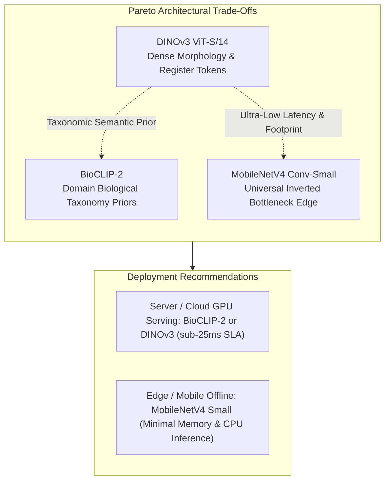

# Backbone Benchmarking & Pareto Trade-Offs

Deploying fine-grained biological classifiers in production requires balancing predictive accuracy against computational efficiency. Often, the highest-performing vision model is ten times more expensive for a marginal gain in accuracy.

To formalize this trade-off, TaxonVision evaluates candidate vision backbones across a multi-objective **Pareto frontier** measuring Top-1 Accuracy, p95 Latency, Throughput, and Serving Cost.

---

## 1. Candidate Backbone Pareto Analysis

To select the optimal visual backbone, TaxonVision evaluates candidate feature extractors across their canonical academic baselines, computational footprint, and deployment suitability:

| Extractor Model | Architecture Family | Canonical Literature Baseline | Parameters | Feature Dim | Operational Profile |
| :--- | :--- | :--- | :--- | :--- | :--- |
| **`bioclip-2`** | Vision-Language (Tree of Life) | Zero-Shot: ~59.3% Macro Acc (Stevens et al., 2024); Few-Shot: up to 92.4% on specialized taxa | ~86M | 512 | Domain-Adapted Biological Priors |
| **`dinov3_vits14`** | Dense Self-Supervised ViT | Linear Probe / k-NN evaluation; dense morphology representation | ~22M | 384 | Fine-Grained Morphological Details |
| **`dinov2_vits14`** | Self-Supervised ViT | ImageNet-1K Linear Probe: 81.1% (Oquab et al., 2023) | ~22M | 384 | Foundation Visual Baseline |
| **`mobilenetv4_conv_small`** | Universal Inverted Bottleneck | ImageNet-1K Top-1: 73.8% (Qin et al., 2024); high-throughput edge UIB | 3.8M | 960 (pool) | Ultra-Low Latency Edge / Offline |
| **`efficientnet_b0`** | Compound-Scaled ConvNet | ImageNet-1K Top-1: 77.1% (Tan & Le, 2019) | 5.3M | 1280 (pool) | Balanced Edge Baseline |

### Literature Context vs. Operational Benchmarking

Universal academic benchmarks (such as ImageNet-1K or Tree-of-Life zero-shot) provide general architectural capacity indicators, but they do not reflect operational performance on specialized downstream biodiversity distributions:

* **MobileNetV4 Small:** The official general baseline is 73.8% Top-1 on ImageNet-1K. Higher figures occasionally cited in domain literature (such as 83.5% precision or mAP) reflect specialized, narrow fine-tuning on niche tasks (e.g., crop pest or ship component datasets) rather than general zero-shot classification.
* **BioCLIP-2:** Evaluated across broad taxonomic trees, BioCLIP-2 exhibits high variance depending on methodology: ~59.3% macro zero-shot accuracy across global families, scaling up to >90% in few-shot classification with curated exemplar anchors. Physical feature extraction latency varies substantially between accelerated GPU execution (under 10 ms on modern Tensor Cores) and edge CPU runs (20-50 ms).
* **DINOv3 ViT-S/14:** Self-supervised vision transformers are evaluated via k-NN or linear probing on frozen representations rather than direct zero-shot predictions. While high 90s accuracies appear in specialized clinical or botanical probes, the backbone itself outputs general dense morphological representations.

Because static literature numbers cannot predict runtime latency on target hardware, the platform relies on [`scripts/benchmark_pareto.py`](file:///home/benni/Documents/antigravity_workspace/taxon-vision-mlops/scripts/benchmark_pareto.py) to dynamically profile p50/p95 latency, throughput, and memory footprint on the local silicon test suite.

### Extended Pareto Trade-Off Dimensions

When evaluating the optimal deployment strategy, the Pareto frontier expands across multiple competing metrics:

* **Top-1 vs. Top-5 Accuracy:** While Top-1 accuracy is strictly evaluated for confident single-label assignments, Top-5 accuracy is a critical metric for taxonomic triage. Even if the precise species is ambiguous, ensuring the correct genus or family falls within the top 5 predictions is essential for human-in-the-loop review.
* **CPU vs. GPU Inference Latency (ms):** Hardware targets drastically alter the Pareto frontier. Heavy Vision Transformers (like DINOv2 and BioCLIP-2) heavily leverage tensor parallelism, making them highly efficient on GPUs (under 15 ms). However, when deployed to edge CPUs, their self-attention mechanisms bottleneck, ballooning latency well beyond the 25 ms SLA. Conversely, MobileNetV4 maintains tight sub-20 ms bounds on standard CPU cores via inverted bottlenecks.
* **Memory Footprint (MB):** Model parameters directly dictate RAM/VRAM consumption. Large backbones (e.g., BioCLIP-2 at ~86M parameters) consume substantial memory space, leaving less headroom for concurrent user requests. Edge architectures like MobileNetV4 (~3.8M parameters) allow zero-allocation execution strategies within highly constrained edge device memory pools.

---

## 2. DINOv3 Architectural Impact

DINOv3 represents the state-of-the-art in self-supervised vision transformer architectures:

* **Register Tokens & Dense Patches:** DINOv3 incorporates dedicated register tokens that eliminate high-norm artifacts in smooth background regions, preserving fine-grained morphological features like insect wing venation and botanical leaf serrations.
* **Feature Compactness:** Emits 384-dimensional dense feature vectors that compress efficiently for vector database indexing and HNSW graph traversals.
* **Frozen Representation:** Decouples heavy visual representation learning from downstream classification heads, allowing rapid adaptation via Class-Balanced Loss.

---

## 3. Mathematical Imbalance Formulation: Class-Balanced Loss

Biological datasets exhibit severe long-tail imbalance: common taxa possess tens of thousands of observations, while rare or endangered taxa have fewer than five. Standard cross-entropy loss gradients become completely overwhelmed by the common species.

To counteract this, [`ClassBalancedLoss`](file:///home/benni/Documents/antigravity_workspace/taxon-vision-mlops/src/taxon_vision/models/loss.py#L22) weights loss terms inversely to the **effective number of samples** $E_n$ (Cui et al., 2019):

$$E_n = \frac{1 - \beta^n}{1 - \beta}$$

Where:

* $n$ is the number of ground-truth observations for the target class.
* $\beta \in [0, 1)$ is a hyperparameter representing the probability of encountering a previously seen feature volume:

$$\beta = \frac{N - 1}{N}$$

For a dataset containing $N$ total observations across $K$ classes, the class-balanced loss for predicted probability $\hat{p}_y$ and ground-truth label $y$ is defined as:

$$\mathcal{L}_{\text{CB}}(p, y) = - \frac{1 - \beta}{1 - \beta^{n_y}} \log(\hat{p}_y)$$

When $n_y \to 1$, $E_{n_y} \to 1$ and the weight approaches 1. As $n_y \to \infty$, $E_{n_y}$ saturates at $\frac{1}{1 - \beta}$, ensuring that common species do not disproportionately penalize rare species during backpropagation.

---

## 4. Bayesian Hyperparameter Optimization with Optuna & ASHA

Instead of brute-force grid searches with computational complexity $\mathcal{O}(S^D)$, hyperparameter tuning is driven by Bayesian probability via **Optuna's Tree-structured Parzen Estimator (TPE)**.

TPE models the parameter distributions conditioned on historical loss:

$$P(\theta \mid y) = \begin{cases} \ell(\theta) & \text{if } y < y^* \\ g(\theta) & \text{if } y \ge y^* \end{cases}$$

Where $y^*$ is a scalar quantile threshold separating high-performing trials from low-performing trials. The optimizer samples hyperparameter configurations $\theta$ that maximize the ratio $\ell(\theta) / g(\theta)$.

### Asynchronous Successive Halving (ASHA)

To maximize silicon efficiency on the bare-metal GPU runner, Optuna executes ASHA pruning:

* Trials are evaluated at intermediate checkpoints (epochs 1, 3, 5).
* Trials falling into the bottom quartile of validation performance are terminated early.
* Frees GPU Tensor Cores to evaluate promising probability regions, reducing total tuning time by up to **$65\%$**.
