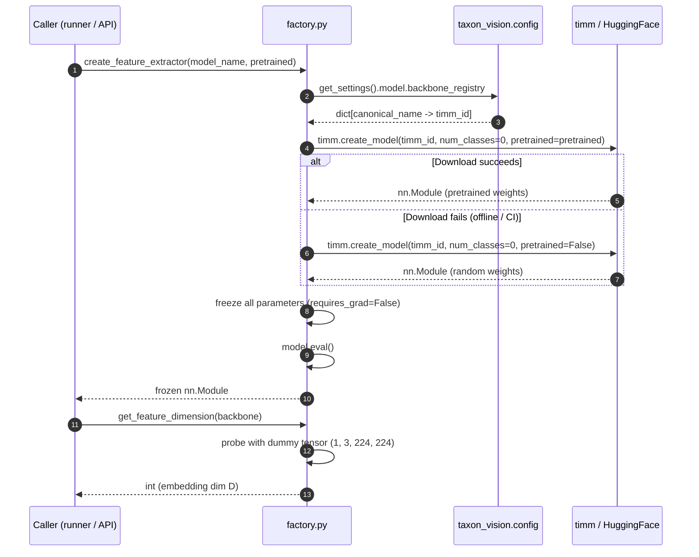
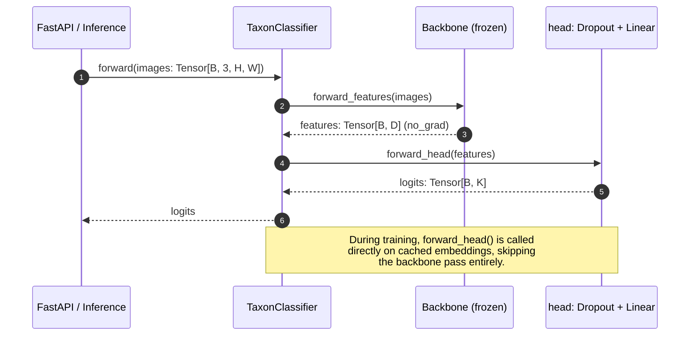
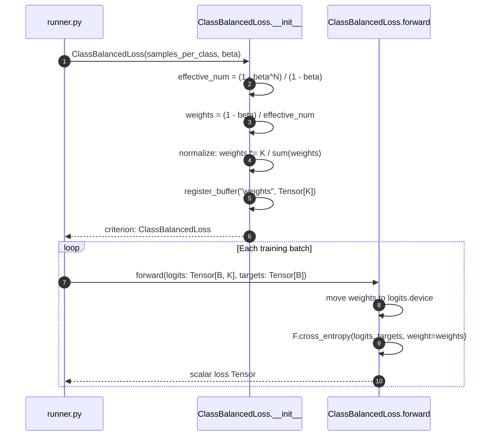

# Vision Model Architecture

TaxonVision decouples feature representation learning from taxonomic classification by
combining a **frozen Vision Foundation Model (VFM) backbone** with a lightweight
**trainable linear head**. This design eliminates catastrophic forgetting while reducing
GPU training time for the classification stage to seconds rather than hours.

## Module Overview

| Module | Class / Function | Role |
| --- | --- | --- |
| `factory.py` | `create_feature_extractor()` | Instantiates frozen timm backbone |
| `factory.py` | `get_feature_dimension()` | Resolves embedding dimensionality |
| `factory.py` | `extract_features()` | Batched image to embedding projection |
| `head.py` | `TaxonClassifier` | End-to-end backbone + trainable head |
| `head.py` | `forward_features()` | Frozen backbone pass - images to embeddings |
| `head.py` | `forward_head()` | Head-only pass - embeddings to logits |
| `loss.py` | `ClassBalancedLoss` | Effective-number-of-samples weighted cross-entropy |

## Backbone Factory

The `factory.py` module provides a centralized registry-driven approach to instantiating
all supported backbones. The canonical model names (e.g. `bioclip-2`, `dinov3`,
`mobilenetv4_conv_small`) are resolved to their corresponding `timm` identifiers from the
application configuration file, eliminating hardcoded magic strings throughout the codebase.

All backbones are loaded with:

* `num_classes=0` - removes the original classification head, returning dense pooled features.
* `requires_grad=False` on every parameter - ensures backbone weights remain frozen during head training.
* `model.eval()` mode set immediately to disable Dropout and BatchNorm stochasticity.



## TaxonClassifier

`TaxonClassifier` is the top-level end-to-end model that holds both the frozen backbone
and the trainable head as two separate sub-modules:

```text
TaxonClassifier
├── backbone: nn.Module     # frozen, requires_grad=False
└── head: nn.Sequential
    ├── nn.Dropout(p)       # regularization
    └── nn.Linear(D -> K)   # trainable weights only
```

It exposes two forward paths to support the **embedding-caching optimization**:

* `forward_features(images)` - runs the frozen backbone and returns `(batch, D)` feature embeddings. Wrapped in `torch.no_grad()`.
* `forward_head(features)` - projects pre-computed embeddings directly to `(batch, K)` logits, bypassing the backbone entirely. Used during all training and hyperparameter tuning loops.



## Class-Balanced Loss

Biological observations follow a severe **Zipfian power-law distribution**: a handful of
common species contribute thousands of training images while rare endemic species may have
fewer than five observations. Naive inverse-frequency weighting amplifies gradient noise
from scarce classes.

`ClassBalancedLoss` instead uses the *effective number of samples* concept from Cui et al.
(CVPR 2019), where $\beta \in [0.0, 1.0)$ controls the degree of assumed feature overlap:

$$E_{N_i} = \frac{1 - \beta^{N_i}}{1 - \beta}, \quad W_i = \frac{1 - \beta}{1 - \beta^{N_i}}, \quad \sum_i W_i = K$$

* When $\beta \to 0$: weights collapse to uniform (standard cross-entropy).
* When $\beta \to 1$: weights approach inverse class frequency.

The `beta` value is part of the Optuna search space and is tuned per training run.



## API Reference

::: taxon_vision.models.factory
::: taxon_vision.models.head
::: taxon_vision.models.loss
