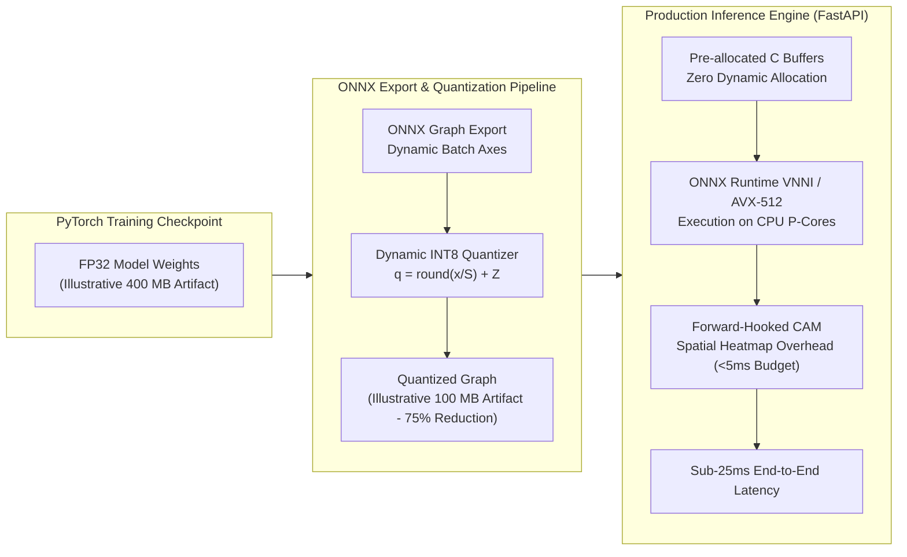

# ONNX Runtime Optimization & Latency Invariants

Operating an interactive biodiversity identification platform requires strict adherence to latency Service Level Agreements (SLAs). While unoptimized PyTorch forward passes on general-purpose CPUs often exceed 100 to 200 ms depending on batch size and architecture, TaxonVision enforces a **fast-path p95 latency budget strictly under 25 milliseconds**.

This latency bound is achieved through Open Neural Network Exchange (ONNX) graph compilation, dynamic Integer-8 (INT8) quantization, zero-allocation hot paths, and forward-hooked interpretability.

---

## 1. Dynamic INT8 Quantization Mathematics

By default, PyTorch constructs weight matrices using 32-bit floating-point (FP32) precision. During production serving, FP32 operations saturate memory bandwidth and inflate cache requirements.

To optimize throughput, [`ONNXQuantizer`](file:///home/benni/Documents/antigravity_workspace/taxon-vision-mlops/src/taxon_vision/inference/quantizer.py) maps continuous 32-bit floating-point weights onto a discrete 8-bit integer grid:

$$q = \text{round}\left(\frac{x}{S}\right) + Z$$

Where:

* $q \in [-128, 127]$ is the resulting 8-bit signed quantized integer.
* $x \in \mathbb{R}$ is the continuous 32-bit floating-point weight or activation value.
* $S \in \mathbb{R}^+$ is the continuous scale factor:

$$S = \frac{x_{\max} - x_{\min}}{255}$$

* $Z \in \mathbb{Z}$ is the integer zero-point offset, aligning real zero with the discrete zero grid to preserve sparse zero-padding accuracy.

### Silicon Acceleration via SIMD & VNNI

Quantizing to INT8 yields immediate computational benefits:

* **Memory Footprint Compression:** Compresses model parameter footprint by **$75\%$** (an exact $4:1$ bit-width ratio; e.g., reducing an illustrative 400 MB checkpoint to approximately 100 MB).
* **Vector Instructions:** Modern x86-64 silicon packs four 8-bit integer operations into the same register space as a single 32-bit float, leveraging AVX-512 Vector Neural Network Instructions (VNNI) or Tensor Cores.
* **Accuracy Preservation:** Published deployment benchmarks across standard vision backbones report a **$2\times$ to $4\times$ latency speedup** on CPU inference with typically less than **$1\%$ degradation** in Top-1 accuracy (subject to verification on target domain splits).

---

## 2. Zero-Allocation Hot Inference Path

Dynamic memory allocation during high-concurrency inference triggers Python memory fragmentation and garbage collection pauses.

TaxonVision enforces Project Mandate `02-inference-latency-invariants.md`:

* **Pre-allocated Contiguous Buffers:** Tensor inputs and intermediate inference arrays are pre-allocated as contiguous C-order NumPy arrays during engine startup ([`ONNXInferenceEngine`](file:///home/benni/Documents/antigravity_workspace/taxon-vision-mlops/src/taxon_vision/inference/onnx_engine.py)).
* **Zero Object Boxing:** Predictions stream through pre-allocated memory addresses without allocating intermediate Python wrapper objects.
* **CPU Core Isolation:** High-frequency ONNX execution threads are pinned strictly to physical Performance-cores (P-cores) to prevent L2/L3 cache evictions.

---

## 3. Forward-Hooked Class Activation Mapping (CAM)

Visual explainability is crucial for taxonomic validation. While modern extensions like Grad-CAM are popular, they require calculating backward gradients:

$$\alpha_k^c = \frac{1}{Z} \sum_{i} \sum_{j} \frac{\partial Y^c}{\partial A_{i, j}^k}$$

Executing gradient backpropagation in a forward-only INT8 ONNX engine is impossible and would introduce significant runtime latency and memory overhead.

[`ForwardHookCAM`](file:///home/benni/Documents/antigravity_workspace/taxon-vision-mlops/src/taxon_vision/inference/cam.py) replaces backpropagation with a forward-only linear combination:

$$L_{\text{CAM}}^c = \text{ReLU}\left(\sum_{k} w_k^c A^k\right)$$

Where $A^k$ represents the spatial feature activations captured during the forward pass, and $w_k^c$ is the static weight connecting channel $k$ to class $c$.

This operation computes pixel-level anatomical heatmaps with minimal forward-pass overhead (targeted under 2 to 5 milliseconds), fully preserving the forward-only, quantization-friendly execution paradigm.
