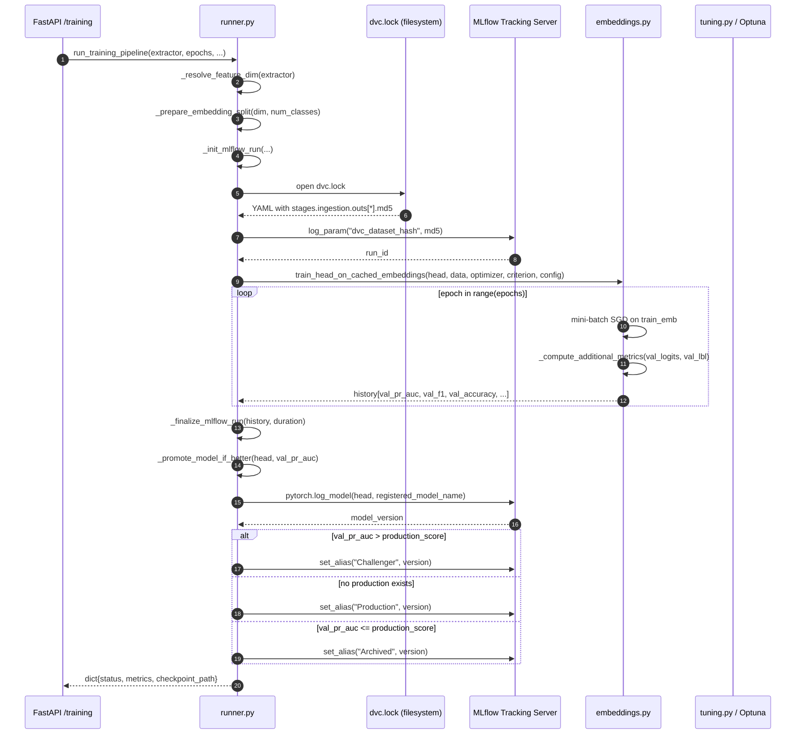
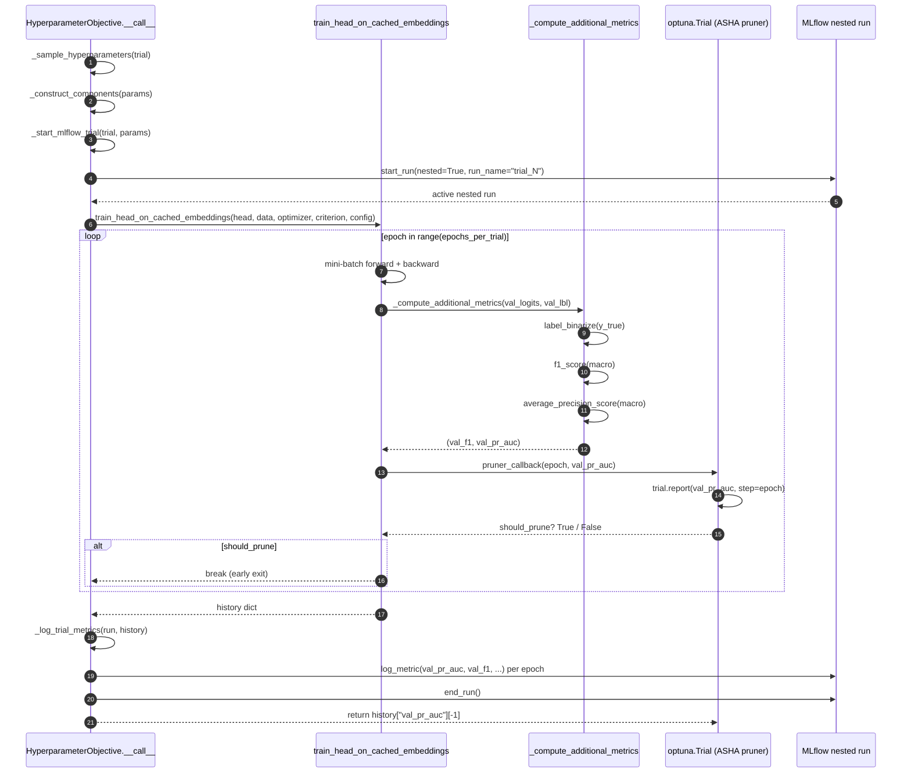
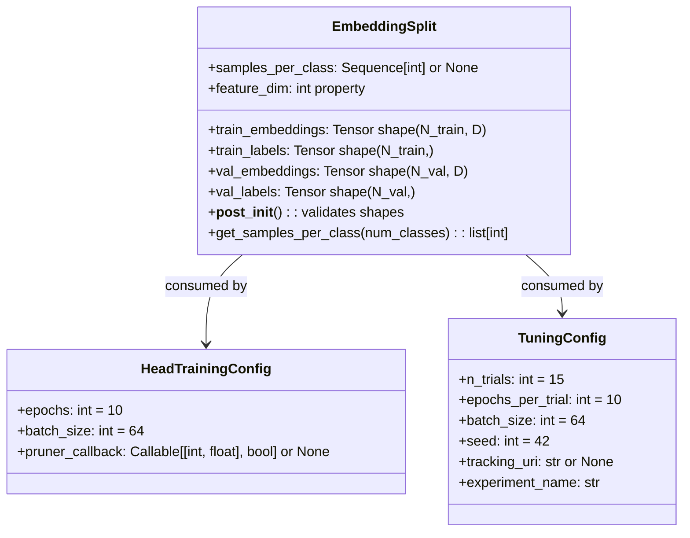

# Classification Head Training Pipeline

The training module (`taxon_vision.models.training`) executes a four-stage pipeline
that trains a lightweight linear classification head on **pre-cached feature embeddings**,
tracks all experiments with MLflow, and automatically promotes the best model using
**Macro PR-AUC** as the sole promotion metric.

## Design Principles

* **Zero backbone backpropagation.** All training iterates only over the
  linear head (`Dropout` + `Linear`), operating on embeddings pre-extracted by the
  frozen backbone. This reduces a full training epoch to milliseconds.
* **Single promotion metric.** Macro PR-AUC is the authoritative comparison signal.
  It is robust to severe class imbalance (characteristic of species observation data)
  and does not require threshold selection.
* **Git-free DVC versioning.** Dataset hashes are sourced by parsing `dvc.lock` directly.
  No `git` commands or `.git` state are required, satisfying the zero-allocation
  inference constraint in sandboxed environments.

## Module Map

| Module | Key Symbol | Responsibility |
| --- | --- | --- |
| `types.py` | `EmbeddingSplit` | Validated data container: train/val tensors + class counts |
| `types.py` | `HeadTrainingConfig` | Epoch budget, batch size, and Optuna pruner callback |
| `types.py` | `TuningConfig` | Optuna trial budget, seed, and MLflow coordinates |
| `embeddings.py` | `train_head_on_cached_embeddings()` | Inner training loop with per-epoch metric history |
| `embeddings.py` | `_compute_additional_metrics()` | Macro F1 and Macro PR-AUC from logits |
| `tuning.py` | `HyperparameterObjective` | Optuna callable wrapping the inner training loop |
| `tuning.py` | `tune_hyperparameters()` | Orchestrates Optuna study with ASHA pruning |
| `runner.py` | `run_training_pipeline()` | Top-level orchestrator called by the FastAPI endpoint |
| `tracking.py` | `_get_dvc_dataset_hash()` | Parses `dvc.lock` for reproducible dataset provenance - **planned: delegate to Jenkins** |
| `tracking.py` | `mlflow_run_scope()` | Context manager that opens parent MLflow run and logs training parameters |
| `tracking.py` | `_promote_model_if_better()` | Compares PR-AUC and assigns Production / Challenger alias - **planned: delegate to Jenkins** |
| `runner.py` | `_dispatch_remote_training()` | HTTP dispatch to FastAPI to trigger training remotely - **planned: delete, replaced by Jenkins trigger** |

## Pipeline Lifecycle & MLflow RAII Strategy

**What we chose:**
The MLflow run lifecycle is strictly managed via a custom `@contextmanager` named `mlflow_run_scope()`. This native Python RAII (Resource Acquisition Is Initialization) pattern guarantees that if the training pipeline crashes (e.g., CUDA OOM), the exception is caught, the run is explicitly marked as `FAILED` in the MLflow tracking registry, and the run is cleanly closed before bubbling the exception up to the FastAPI route.

**Why we chose it (Semantic Validation):**
A common anti-pattern is tracking state via detached boolean flags (e.g., `is_active: bool`) across multiple methods. If an unhandled exception occurs in a deep submodule, the top-level script crashes without closing the MLflow run. This leaves orphaned, zombie runs stuck in a perpetual `RUNNING` state in the MLflow UI, requiring manual DB cleanup and breaking downstream automation that polls for run completion. The RAII context manager semantically links the scope of the Python execution block directly to the MLflow lifecycle, ensuring perfect state consistency.

## Full Pipeline Sequence



## Inner Training Loop

`train_head_on_cached_embeddings()` in `embeddings.py` is the hot-path function.
It receives pre-built tensors from `EmbeddingSplit` and runs a standard mini-batch
SGD loop. After each epoch, it computes three validation metrics:

1. **Top-1 accuracy** - quick sanity check, logged but not used for promotion.
2. **Macro F1-Score** - average F1 across all classes.
3. **Macro PR-AUC** - primary optimization and promotion metric.

The optional `HeadTrainingConfig.pruner_callback(epoch, val_pr_auc) -> bool` is invoked
at the end of every epoch. During hyperparameter tuning, Optuna injects a callback that
reports the current PR-AUC to the ASHA pruner and signals early stopping if the trial
is statistically unlikely to beat the current best.



## EmbeddingSplit Data Container

`EmbeddingSplit` is a frozen dataclass that validates tensor shapes at construction time.
It is the single source of truth for both training tensors and class frequency information,
removing parameter clutter from function signatures.



## Model Promotion Strategy

Promotion is fully automated and uses a single metric to guarantee consistent comparison:

| Condition | Assigned Alias |
| --- | --- |
| No model with `Production` alias exists | `Production` |
| `new_pr_auc > production_pr_auc` | `Challenger` |
| `new_pr_auc <= production_pr_auc` | `Archived` |

**Why Macro PR-AUC?** Accuracy and F1 both require threshold decisions and are sensitive
to class imbalance. PR-AUC integrates precision-recall trade-offs across all thresholds
and all classes without normalization bias, making it the most reliable single-number
summary for the long-tailed taxonomic classification task.

## Planned Orchestration Transition

Prior to modularization, `runner.py` acted as a God script. We have already initiated the separation of concerns by moving MLflow and DVC tracking logic into `tracking.py`.
However, the pipeline logic still relies heavily on Python orchestration and does not scale perfectly when compute
jobs need to run in dedicated Kubernetes pods.

The planned transition introduces a **two-layer CI architecture**:

### Layer 1: GitHub Actions (lightweight gates - current)

All CPU-bound quality gates continue to run on GitHub Actions via ARC runner pods:

* Lint (`ruff`), type checking (`mypy`), pre-commit hooks.
* Unit and integration tests on the `ci-dev` (CPU) Pixi environment.
* License compliance audit and OKF frontmatter validation.
* Conformal coverage audit.
* Docker image build and push.
* DVC data push / pull.

On merge to `main`, GitHub Actions fires a webhook to trigger Jenkins:

```yaml
# End of GitHub Actions CI workflow
- name: Trigger Jenkins training pipeline
  if: github.ref == 'refs/heads/main'
  run: |
    curl -X POST "${{ secrets.JENKINS_URL }}/job/taxon-vision-train/build" \
      --user "${{ secrets.JENKINS_USER }}:${{ secrets.JENKINS_TOKEN }}"
```

### Layer 2: Jenkins (heavy compute - planned)

Jenkins runs on the bare-metal cluster with direct access to the GPU pod pool.
Each stage runs in an isolated Kubernetes pod, requesting exact resources:

```text
stage('Ingest')    -> CPU pod  - DVC pull, extract dataset hash from dvc.lock
stage('Train')     -> GPU pod  - run_training_pipeline() (pure ML, no promotion logic)
stage('Evaluate')  -> CPU pod  - query MLflow, compare PR-AUC against Production alias
stage('Promote')   -> CPU pod  - set_registered_model_alias() Challenger / Production
stage('Deploy')    -> CPU pod  - rolling restart of FastAPI Kubernetes deployment
```

### Impact on Python Orchestration

Once Jenkins is in place, the following functions become dead code and will be deleted
from `tracking.py` and `runner.py`, reducing the orchestration footprint further:

* `_get_dvc_dataset_hash()` (in `tracking.py`) - moved to the Jenkins `Ingest` stage as a bash step.
* `_promote_model_if_better()` (in `tracking.py`) - moved to the Jenkins `Evaluate` and `Promote` stages.
* `_dispatch_remote_training()` (in `runner.py`) - deleted entirely; Jenkins triggers jobs directly.
* `train_cli()` argument complexity - simplified to just `extractor`, `epochs`, `batch_size`, `lr`.

The result is a Python training package that only a Data Scientist needs to read: PyTorch modules,
loss functions, and metric evaluation. All pipeline wiring lives in the `Jenkinsfile`.

## API Reference

::: taxon_vision.models.training.types
::: taxon_vision.models.training.embeddings
::: taxon_vision.models.training.runner
::: taxon_vision.models.training.tuning
