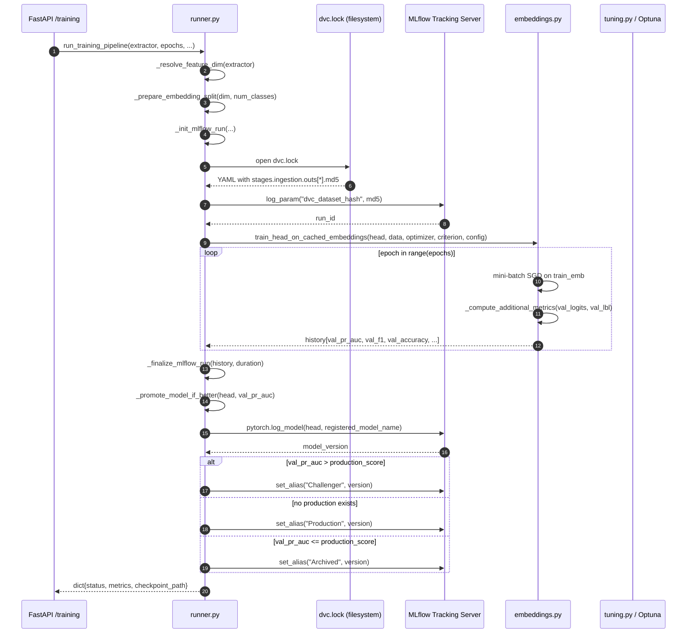
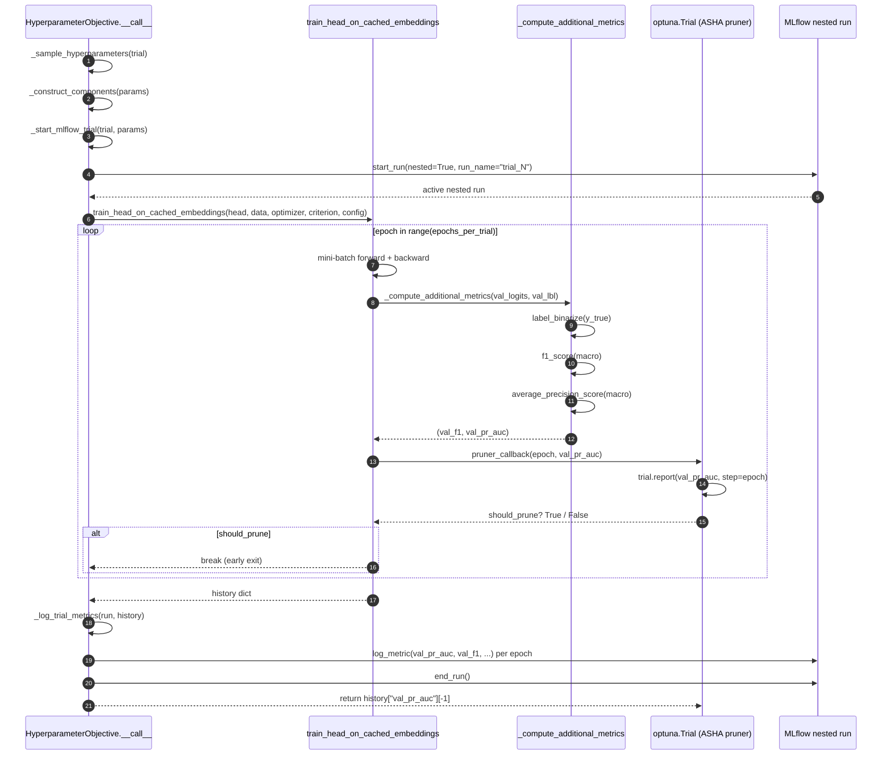
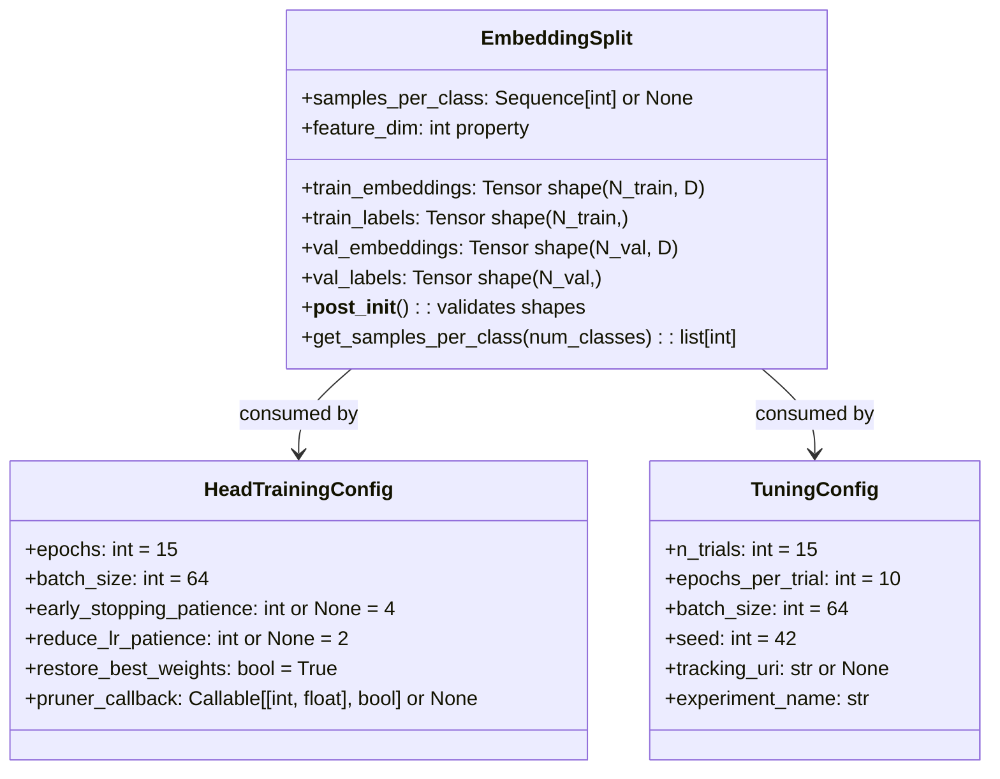

# Classification Head Training Pipeline

The training module (`taxon_vision.models.training`) executes a four-stage pipeline
that trains a lightweight linear classification head on **pre-cached feature embeddings**,
tracks all experiments with MLflow, and automatically promotes the best model using
**Macro PR-AUC** as the sole promotion metric.

## Design Principles

* **Pure remote CI/CD execution paradigm.** The local developer workstation has zero dedicated GPU resources for model training and serves strictly as an authoring, testing, and orchestration plane. All PyTorch model training, Optuna hyperparameter sweeps, and ONNX graph serialization execute remotely on bare-metal CI/CD agents (`hive-mind`) inside isolated Kubernetes pods equipped with GPU time-slicing slots and VRAM limits.
* **Zero backbone backpropagation.** All training iterates only over the
  linear head (`Dropout` + `Linear`), operating on embeddings pre-extracted by the
  frozen backbone (`vit_base_patch14_reg4_dinov2`, `bioclip-2`, `mobilenetv4_conv_small`). This reduces a full training epoch to milliseconds.
* **Class-Balanced Loss for Long-Tail Distributions.** The loss formulation is defined as:

  $$\mathcal{L}_{\text{CB}}(p, y) = -\frac{1 - \beta}{1 - \beta^{n_y}} \log(p_y)$$

  Where $\beta \to 1$ approximates standard class-frequency inverse weighting and intermediate $\beta \in [0.99, 0.9999]$ is optimal for long-tail species classification.
* **Multi-Head Hierarchical Taxonomic Loss.** Rather than relying solely on a single-head flat classification over terminal leaf nodes, the system can optionally project embeddings into a multi-head taxonomy (Class, Order, Family, Genus, Species) ensuring coarse-grained taxonomic errors are penalized far more heavily than fine-grained errors.
* **Single promotion metric.** Macro PR-AUC is the authoritative comparison signal.
  It is robust to severe class imbalance (characteristic of species observation data)
  and does not require threshold selection.
* **DagsHub Integrated Ecosystem.** DVC remote storage (`s3://dvc`), centralized MLflow experiment tracking (`https://dagshub.com/foersben/taxon-vision-mlops.mlflow`), and hosted Label Studio are unified under DagsHub. Credentials are authenticated securely in memory via Linux Secret Service without persistent plaintext tokens on disk.
* **Git-free DVC versioning.** Dataset hashes are sourced by parsing `dvc.lock` directly.
  No `git` commands or `.git` state are required, satisfying the zero-allocation
  inference constraint in sandboxed environments.

## Module Map

| Module | Key Symbol | Responsibility |
| --- | --- | --- |
| `types.py` | `EmbeddingSplit` | Validated data container: train/val tensors + class counts |
| `types.py` | `HeadTrainingConfig` | Epoch budget, batch size, callbacks, and Optuna pruner callback |
| `types.py` | `TuningConfig` | Optuna trial budget, seed, and MLflow coordinates |
| `embeddings.py` | `train_head_on_cached_embeddings()` | Inner training loop with best model tracking, early stopping, and LR plateau scheduling |
| `embeddings.py` | `_compute_additional_metrics()` | Macro F1 and Macro PR-AUC from logits |
| `tuning.py` | `HyperparameterObjective` | Optuna callable wrapping the inner training loop |
| `tuning.py` | `tune_hyperparameters()` | Orchestrates Optuna study with TPE sampling and ASHA pruning |
| `runner.py` | `run_training_pipeline()` | Top-level orchestrator supporting `--tune` and standard training |
| `tracking.py` | `_get_dvc_dataset_hash()` | Parses `dvc.lock` for reproducible dataset provenance |
| `tracking.py` | `mlflow_run_scope()` | RAII context manager that opens parent MLflow run and logs training parameters |
| `tracking.py` | `_promote_model_if_better()` | Compares PR-AUC and assigns Production / Challenger alias |

## Pipeline Lifecycle & MLflow RAII Strategy

**What we chose:**
The MLflow run lifecycle is strictly managed via a custom `@contextmanager` named `mlflow_run_scope()`. This native Python RAII (Resource Acquisition Is Initialization) pattern guarantees that if the training pipeline crashes (e.g., CUDA OOM), the exception is caught, the run is explicitly marked as `FAILED` in the MLflow tracking registry, and the run is cleanly closed before bubbling the exception up to the FastAPI route.

**Why we chose it (Semantic Validation):**
A common anti-pattern is tracking state via detached boolean flags (e.g., `is_active: bool`) across multiple methods. If an unhandled exception occurs in a deep submodule, the top-level script crashes without closing the MLflow run. This leaves orphaned, zombie runs stuck in a perpetual `RUNNING` state in the MLflow UI, requiring manual DB cleanup and breaking downstream automation that polls for run completion. The RAII context manager semantically links the scope of the Python execution block directly to the MLflow lifecycle, ensuring perfect state consistency.

## Full Pipeline Sequence



## Inner Training Loop & Execution Callbacks

`train_head_on_cached_embeddings()` in `embeddings.py` is the hot-path execution function.
It receives pre-built tensors from `EmbeddingSplit` and runs a mini-batch SGD loop with adaptive metric evaluation and convergence callbacks. After each epoch, it computes three validation metrics:

* **Top-1 accuracy:** Diagnostic check, logged to MLflow but not used for promotion decisions.
* **Macro F1-Score:** Harmonic mean of precision and recall across all modelled taxa.
* **Macro PR-AUC:** Primary optimization and automated model promotion metric.

### Training Callbacks

The inner loop incorporates three convergence callbacks:

* **Best Model Weights Restoration (`restore_best_weights=True`):** Tracks validation Macro PR-AUC at each epoch. If an epoch yields a new historical high, a deep copy of the model state dict is cached. When training completes (either by reaching the epoch limit or via early stopping), the model weights are automatically restored to the optimal checkpoint.
* **Early Stopping Callback (`early_stopping_patience=4`):** Monitors validation Macro PR-AUC across epochs. If the metric fails to improve for 4 consecutive epochs, training terminates early, preventing overfitting on rare long-tail classes and saving compute cycles.
* **Learning Rate Reduction on Plateau (`reduce_lr_patience=2`):** Wraps the optimizer in `torch.optim.lr_scheduler.ReduceLROnPlateau(optimizer, mode="max", factor=0.5, patience=2)`. When validation PR-AUC plateaus for 2 epochs, the learning rate is halved, allowing fine-grained convergence into sharper minima.
* **Optuna Pruner Callback (`pruner_callback`):** When executing hyperparameter sweeps, Optuna injects a callback that reports intermediate PR-AUC to the ASHA pruner, terminating underperforming trials before full epoch completion.

## Optimal Training Dynamics & Hyperparameters

Empirical benchmarking on biological observation distributions yields the following configuration guidelines:

* **Epoch Budget (10-15 Epochs):** Linear probing on pre-extracted foundation embeddings converges rapidly. Optimal validation PR-AUC is routinely reached between epochs 8 and 12. Training past 15 epochs increases the risk of memorizing long-tail noise.
* **Batch Size Budgeting:**
    * **Batch Size 64 for Cached Embeddings:** Minimizes gradient variance while maximizing SIMD throughput when operating purely on cached feature vectors.
    * **Batch Size 32 for ViT Feature Extraction:** When extracting embeddings from raw images using the RTX 5070 Ti (16 GB GDDR7 VRAM), batch size 32 operates well within the 70% VRAM cap (`TAXON_CUDA_MEMORY_FRACTION=0.7`), reserving headroom for the host system and live inference.
* **Biological Data Augmentation Invariants:**
    * **Horizontal Flips Permitted:** Biological organisms exhibit bilateral or radial symmetry across the horizontal plane; horizontal reflection generates physically valid training exemplars.
    * **Vertical Flips Strictly Prohibited:** Gravity, geotropism, and phototropism define strict environmental orientations in biological imagery. Flipping specimens vertically produces unphysical specimens (e.g. inverted tree canopies or upside-down insects) that distort spatial priors.

## Optuna Bayesian Hyperparameter Optimization

Optuna explores hyperparameter search spaces using the Tree-structured Parzen Estimator (`TPESampler`) coupled with Asynchronous Successive Halving (`SuccessiveHalvingPruner`/ASHA):

* **Search Space Formulation:**
    * **Learning Rate ($\eta$):** Log-uniform distribution over $[10^{-4}, 10^{-2}]$.
    * **Weight Decay ($\lambda$):** Log-uniform distribution over $[10^{-6}, 10^{-2}]$.
    * **Dropout Rate ($p$):** Uniform distribution over $[0.0, 0.5]$.
    * **Class-Balanced Loss $\beta$:** Uniform distribution over $[0.99, 0.9999]$, controlling effective sample re-weighting for long-tail classes.
* **ASHA Pruning Invariants:** Initialized with `min_resource=2` and `reduction_factor=2`. Trials reporting bottom-quartile PR-AUC after 2 epochs are pruned immediately.
* **CLI Trigger:**

```bash
pixi run -e dev python -m taxon_vision.models.training.runner --tune --n-trials 15
```



## EmbeddingSplit Data Container

`EmbeddingSplit` is a frozen dataclass that validates tensor shapes at construction time.
It is the single source of truth for both training tensors and class frequency information,
removing parameter clutter from function signatures.



## Model Promotion Strategy

Promotion is fully automated and uses a single metric to guarantee consistent comparison:

| Condition | Assigned Alias |
| --- | --- |
| No model with `Production` alias exists | `Production` |
| `new_pr_auc > production_pr_auc` | `Challenger` |
| `new_pr_auc <= production_pr_auc` | `Archived` |

**Why Macro PR-AUC?** Accuracy and F1 both require threshold decisions and are sensitive
to class imbalance. PR-AUC integrates precision-recall trade-offs across all thresholds
and all classes without normalization bias, making it the most reliable single-number
summary for the long-tailed taxonomic classification task.

## Remote CI/CD Execution & Automated Training on Main

To prevent local workstation compute saturation and guarantee strict mathematical reproducibility, all model training and ONNX compilation tasks execute remotely on the bare-metal Kubernetes cluster (`hive-mind`). The local workstation operates purely as an authoring, linting, and orchestration plane.

### The Automated CI/CD Lifecycle on `main`

The continuous integration and delivery pipeline defined in `Jenkinsfile` automatically executes the `Model Training & Checkpoint (GPU)` stage when commits land on `main`:

```text
1. Prepare Toolchain  -> Ephemeral k3s pod mounts host NVMe Rattler cache
2. Static Quality     -> Parallel Ruff lint, MyPy typecheck, License audit, OKF validation
3. Pytest Suite       -> Unit tests enforcing >= 78% line coverage
4. Conformal Invariants -> Split conformal coverage empirical validation (1 - alpha >= 0.95)
5. Strict Docs Build  -> Knowledge graph generation & strict Zensical build
6. GPU Model Training -> Bare-metal GPU runner executes PyTorch training on hive-mind (main only)
7. Rolling Deployment -> Zero-downtime rollout restart of deployment/taxon-vision-api
```

### GPU Time-Slicing & Memory Isolation

During Stage 6, the runner interacts directly with the cluster's GPU topology:

* **Time-Slicing Slot:** The physical NVIDIA RTX 5070 Ti is partitioned into 4 virtual GPU slots via the NVIDIA Kubernetes Device Plugin. The training job consumes 1 virtual slot, allowing concurrent execution without locking out other workloads.
* **VRAM Memory Fraction Cap:** The training process enforces `TAXON_CUDA_MEMORY_FRACTION=0.7`. This reserves 30% of VRAM (4.8 GB) for live ONNX Runtime inference serving and display buffers.
* **DVC State Synchronization:** DVC pulls the latest dataset state from DagsHub S3 (`s3://dvc`), verifies MD5 checksums, and feeds the training pipeline.
* **ONNX Export & Model Refresh:** Upon completing the training loop (with early stopping and best weight restoration), the updated model head is exported to `models/classifier_head.onnx`.
* **Zero-Downtime Rolling Update:** Jenkins applies the updated deployment and issues `kubectl rollout restart deployment/taxon-vision-api -n taxon-vision`, smoothly transitioning inference traffic to the new model checkpoint with zero downtime.

## API Reference

::: taxon_vision.models.training.types
::: taxon_vision.models.training.embeddings
::: taxon_vision.models.training.runner
::: taxon_vision.models.training.tuning
