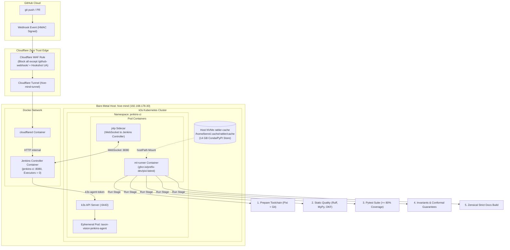

# Jenkins CI/CD Architecture & Ephemeral Runner Topology

This document records the architectural design, security topology, and implementation details of the bare-metal CI/CD infrastructure powering TaxonVision on `hive-mind`.



---

## 1. Architectural Principles & Design Invariants

The bare-metal CI/CD design resolves the operational tension between developer agility, bare-metal hardware utilization, and edge security:

* **Zero Public Ingress Ports:** Rather than exposing home router NAT ports or DDNS records, all external ingress terminates on Cloudflare edge servers and routes to the host via an outbound-initiated tunnel (`cloudflared`).
* **Edge-Level Attack Surface Elimination:** The public controller hostname is shielded by a Cloudflare WAF custom expression that blocks 100% of standard web browser traffic, search crawler requests, and automated scanners, permitting solely authenticated GitHub webhook deliveries.
* **Separation of Control and Execution Planes:** The Jenkins controller is configured with 0 local executors. It acts exclusively as a workflow orchestrator, dispatching workloads to isolated, disposable Kubernetes pods.
* **Ephemeral Pod Lifecycle:** Build agents are scheduled on-demand inside `k3s` and deleted immediately upon pipeline completion (`podRetention: Never`), eliminating environment drift and dirty state accumulation across builds.
* **Hardware Slicing & Cache Acceleration:** Continuous integration test suites run against CPU profiles (`ci-dev`), preserving the single RTX 5070 Ti GPU for training and real-time inference. Package resolution latency is reduced from minutes to seconds via a shared NVMe Rattler cache mount.

---

## 2. Ingress Architecture & Edge Security

### 2.1 Domain Separation Strategy

To ensure strict operational isolation between primary identity services (`.de`) and CI/CD infrastructure, a dedicated domain (`benjamin-foerster.eu`) was acquired via Strato. This decouples DNS management, edge certificate rotation, and Zero Trust access policies from personal web properties.

### 2.2 Nameserver Delegation & Cloudflare Zone

Strato nameservers were replaced with designated Cloudflare Zero Trust nameservers (`jean.ns.cloudflare.com` and `keanu.ns.cloudflare.com`). Default parking records (A, AAAA, CNAME `www`/`*`, and `_autodiscover._tcp`) were deleted during onboarding to ensure all inbound resolution passes through Cloudflare proxy nodes without legacy record interference.

### 2.3 Cloudflare Tunnel Topology

The connection between the Cloudflare Edge and the physical server is maintained by a lightweight daemon (`cloudflared`) running in Docker. The tunnel (`hive-mind-tunnel`) initiates outbound HTTPS/QUIC connections to Cloudflare point-of-presence (PoP) edge nodes, establishing a virtual conduit.

Within Cloudflare Zero Trust, public ingress for `jenkins.benjamin-foerster.eu` is routed over the tunnel directly to the container service destination `http://jenkins:8080` across the internal Docker bridge network.

### 2.4 Cloudflare WAF Edge Filtering

Because the controller URL is publicly resolvable, a Cloudflare WAF rule enforces perimeter isolation. The rule evaluates every incoming HTTP request at the Cloudflare Edge:

```text
(http.host eq "jenkins.benjamin-foerster.eu" and not (http.request.uri.path eq "/github-webhook/" and http.user_agent contains "GitHub-Hookshot"))
```

* **Permitted Traffic:** Requests targeting `/github-webhook/` containing the official `GitHub-Hookshot` user-agent header.
* **Blocked Traffic:** All direct browser requests, port scans, and automated vulnerability probes, which receive an HTTP 403 Block response from Cloudflare before reaching the host tunnel.

---

## 3. Host Container Topology on `hive-mind`

### 3.1 Docker Stack Configuration

The Jenkins controller and the Cloudflare Tunnel daemon operate as co-located services within `/home/benni/jenkins/docker-compose.yml`:

```yaml
services:
  jenkins:
    image: jenkins/jenkins:lts-jdk25
    container_name: jenkins-ci
    restart: unless-stopped
    user: root
    ports:
      - "8080:8080"
      - "50000:50000"
    extra_hosts:
      - "host.docker.internal:host-gateway"
    volumes:
      - ./jenkins_home:/var/jenkins_home
      - /var/run/docker.sock:/var/run/docker.sock
      - /usr/bin/docker:/usr/bin/docker:ro
    environment:
      - JAVA_OPTS=-Djenkins.install.runSetupWizard=false

  cloudflared:
    image: cloudflare/cloudflared:latest
    container_name: cloudflared-tunnel
    restart: unless-stopped
    command: tunnel --no-autoupdate run --token <TUNNEL_TOKEN>
    depends_on:
      - jenkins
```

* **Storage Persistence:** Controller state, plugin binaries, job definitions, and credentials reside in `/home/benni/jenkins/jenkins_home`.
* **Zero Setup Wizard:** The environment flag `JAVA_OPTS=-Djenkins.install.runSetupWizard=false` allows programmatic bootstrap without default setup wizard blocks.
* **Service Dependency:** The tunnel daemon declares `depends_on: [jenkins]`, ensuring local endpoints are available before tunnel links register.

### 3.2 Controller Hardening Measures

* **Built-In Node Deprovisioning:** The built-in Jenkins node is configured with 0 executors. This ensures untrusted pipeline scripts cannot execute commands directly on the controller container or access mounted host sockets.
* **Canonical URL Configuration:** The canonical Jenkins URL is designated as `https://jenkins.benjamin-foerster.eu/`. Local administrative access occurs over LAN (`http://192.168.178.30:8080`), bypassing the external WAF block.

---

## 4. GitHub Integration & Authentication Architecture

The automated build ingestion pipeline integrates four core elements:

* **GitHub Webhook:** Configured repository webhook delivering event payloads to `https://jenkins.benjamin-foerster.eu/github-webhook/`.
* **Shared Secret:** HMAC secret stored within Jenkins Credentials to validate payload integrity and sender authenticity.
* **Jenkins Multibranch Pipeline Job:** Discovers active repository branches and open pull requests automatically.
* **Kubernetes Build Agent:** Isolated execution environment provisioned inside the `jenkins-ci` namespace.

### 4.1 Webhook Verification & HMAC Signatures

GitHub webhook deliveries are verified using an HMAC shared secret stored within Jenkins Global Credentials (`github-webhook-hmac-secret`). When GitHub dispatches payload data, Jenkins evaluates the `X-Hub-Signature-256` header against this secret before queuing pipeline jobs, preventing unauthorized job triggers.

### 4.2 GitHub API & Repository Access

* **GitHub Server Binding:** A system-level GitHub Server configuration connects to `https://api.github.com` using a scoped Personal Access Token (`github-ci-pat`). This allows Jenkins to manage commit statuses and PR checks.
* **Branch Source Authentication:** Standard Git cloning operations require basic HTTPS credentials. A dedicated credential (`github-branch-source-pat`) is linked to the GitHub Branch Source plugin for repository checkouts.

### 4.3 Multibranch Pipeline Discovery & Governance

The pipeline project (`taxon-vision-mlops`) is configured as a Multibranch Pipeline:

* **PR Branch De-duplication:** The branch discovery strategy explicitly excludes branches that have open pull requests, preventing redundant parallel executions on identical commit hashes.
* **Orphaned Item Cleanup:** An automated pruning policy (`Days to keep: 7`, `Max # to keep: 10`) terminates active builds and removes cached job items if a feature branch or pull request is deleted on GitHub.

---

## 5. k3s Kubernetes Agent Topology

### 5.1 RBAC Manifest & Security Envelope Architecture

The Kubernetes security boundary governing dynamic runner pod provisioning is defined in [deploy/k8s/jenkins-agent-rbac.yaml](file:///home/benni/Documents/antigravity_workspace/taxon-vision-mlops/deploy/k8s/jenkins-agent-rbac.yaml). This manifest establishes a least-privilege administrative boundary within `k3s`, preventing ephemeral pipeline agents or controller provisioning operations from interacting with cluster system services or other namespaces.

```yaml
apiVersion: v1
kind: Namespace
metadata:
  name: jenkins-ci
---
apiVersion: v1
kind: ServiceAccount
metadata:
  name: jenkins-agent
  namespace: jenkins-ci
---
apiVersion: rbac.authorization.k8s.io/v1
kind: Role
metadata:
  name: jenkins-agent-role
  namespace: jenkins-ci
rules:
  - apiGroups: [""]
    resources: ["pods", "pods/exec", "pods/log"]
    verbs: ["create", "delete", "get", "list", "patch", "update", "watch"]
  - apiGroups: [""]
    resources: ["events"]
    verbs: ["get", "list", "watch"]
---
apiVersion: rbac.authorization.k8s.io/v1
kind: RoleBinding
metadata:
  name: jenkins-agent-binding
  namespace: jenkins-ci
subjects:
  - kind: ServiceAccount
    name: jenkins-agent
    namespace: jenkins-ci
roleRef:
  kind: Role
  name: jenkins-agent-role
  apiGroup: rbac.authorization.k8s.io
---
apiVersion: v1
kind: Secret
metadata:
  name: jenkins-agent-token
  namespace: jenkins-ci
  annotations:
    kubernetes.io/service-account.name: jenkins-agent
type: kubernetes.io/service-account-token
```

#### Detailed Breakdown of Manifest Resources

The manifest declares five Kubernetes objects designed to isolate runtime compute, decouple authentication, and restrict administrative verbs:

* **1. Namespace (`jenkins-ci`): Execution Boundary Isolation**
    * Creates an explicit organizational and security perimeter for all transient CI/CD operations.
    * Isolates pod creation, ephemeral storage, and secret tokens from the `default` and `kube-system` namespaces.
    * Restricts the blast radius of runaway processes, pod crashes, or resource exhaustion to a dedicated slice of cluster resources.

* **2. ServiceAccount (`jenkins-agent`): Least-Privilege Identity**
    * Defines a non-human, machine identity within the `jenkins-ci` namespace.
    * Adheres strictly to the Principle of Least Privilege (PoLP) by preventing the Jenkins controller from running with cluster-wide administrative privileges (`cluster-admin`).
    * Ensures that tokens issued to Jenkins can only authenticate actions within this single namespace.

* **3. Role (`jenkins-agent-role`): Granular RBAC Permissions**
    * Scoped strictly at the namespace level (`Role`) rather than cluster-wide (`ClusterRole`).
    * **Core Pod Operations (`pods`, verbs: `create`, `delete`, `get`, `list`, `patch`, `update`, `watch`):**
        * `create`: Allows the Jenkins Kubernetes plugin to provision ephemeral runner pods dynamically when jobs enter the build queue.
        * `delete`: Allows automated cleanup and garbage collection of runner pods upon build completion, pipeline abort, or timeout.
        * `get`, `list`, `watch`: Enables the controller to observe state changes as pods transition through `Pending`, `ContainerCreating`, `Running`, `Completed`, or `Error`.
        * `patch`, `update`: Permits the controller to update pod metadata, labels, and termination state during pipeline execution.
    * **Interactive Command Execution (`pods/exec`, verbs: `create`, `get`):**
        * Grants permission to invoke in-container command pipelines via the Kubernetes API streaming channel. This powers declarative pipeline steps such as `container('ml-runner') { sh '...' }`.
    * **Console Telemetry Streaming (`pods/log`, verbs: `get`, `list`, `watch`):**
        * Grants streaming access to standard output and standard error from both the `jnlp` sidecar and the `ml-runner` container, piping build logs directly into the Jenkins console in real time.
    * **Cluster Diagnostic Observability (`events`, verbs: `get`, `list`, `watch`):**
        * Permits read-only observation of Kubernetes cluster events in `jenkins-ci`. When an agent fails to schedule or crashes (e.g. `FailedScheduling` due to CPU limits, `ImagePullBackOff`, or `OOMKilled`), Jenkins captures the event message and surfaces the root cause in the build console.

* **4. RoleBinding (`jenkins-agent-binding`): Association & Scope Containment**
    * Attaches the `jenkins-agent` ServiceAccount to `jenkins-agent-role` strictly within the `jenkins-ci` namespace.
    * Guarantees that the granted capabilities cannot be exercised outside the `jenkins-ci` namespace boundary.

* **5. Secret (`jenkins-agent-token`): Modern Token Controller Bootstrapping**
    * Declared with `type: kubernetes.io/service-account-token` and annotation `kubernetes.io/service-account.name: jenkins-agent`.
    * **Kubernetes v1.24+ Context:** Starting in Kubernetes v1.24, the control plane no longer auto-generates perpetual secret tokens upon `ServiceAccount` creation, favoring ephemeral projected volume tokens. However, external controllers (such as Jenkins running in Docker outside the Kubernetes control plane) require a persistent bearer token to authenticate over `https://192.168.178.30:6443`.
    * Declaring this Secret explicitly instructs the Kubernetes `service-account-token` controller to mint a signed bearer JWT, embed the cluster CA certificate, and populate the secret data fields dynamically. This avoids hardcoding sensitive credentials in source control while providing a stable authentication token for the Jenkins Kubernetes Cloud plugin.

### 5.2 Kubernetes Cloud Configuration in Jenkins

The Jenkins Kubernetes plugin manages agent pod lifecycles using the following configuration parameters:

* **Kubernetes Control Plane URL:** Targeted at the internal API endpoint `https://192.168.178.30:6443` using the k3s cluster CA certificate and `jenkins-agent-token`.
* **Internal Routing Policy:** The **Jenkins URL** is designated as `http://192.168.178.30:8080`. This directs agent traffic over the internal bridge network, avoiding the public Cloudflare WAF barrier.
* **WebSocket Multiplexing:** Communication between agents and the controller utilizes HTTP WebSocket streaming, eliminating the need to expose dedicated JNLP TCP listener ports (e.g. `50000`).
* **Concurrency & Retention Limits:** Maximum agent concurrency is restricted to 2 pods, and pod retention is set to `Never` with garbage collection enabled to guarantee immediate resource recycling upon build termination.

---

## 6. Jenkinsfile Architecture & Pipeline Specification

The declarative pipeline logic is declared in [Jenkinsfile](file:///home/benni/Documents/antigravity_workspace/taxon-vision-mlops/Jenkinsfile).

### 6.1 Complete Declarative Pipeline Definition

```groovy
pipeline {
  agent {
    kubernetes {
      cloud 'k3s'
      defaultContainer 'ml-runner'
      yaml '''
apiVersion: v1
kind: Pod
metadata:
  labels:
    app.kubernetes.io/name: taxon-vision-jenkins-agent
spec:
  containers:
  - name: ml-runner
    image: ghcr.io/prefix-dev/pixi:latest
    command: ["sleep"]
    args: ["99d"]
    tty: true
    volumeMounts:
    - name: rattler-cache
      mountPath: /root/.cache/rattler/cache
    resources:
      limits:
        memory: "16Gi"
        cpu: "8"
      requests:
        memory: "4Gi"
        cpu: "2"
  volumes:
  - name: rattler-cache
    hostPath:
      path: /home/benni/.cache/rattler/cache
      type: DirectoryOrCreate
'''
    }
  }

  options {
    buildDiscarder(logRotator(numToKeepStr: '15', daysToKeepStr: '14'))
    timeout(time: 45, unit: 'MINUTES')
    timestamps()
    disableConcurrentBuilds(abortPrevious: true)
  }

  stages {
    stage('Prepare Toolchain') {
      steps {
        container('ml-runner') {
          sh '''
            echo ">>> Setting up toolchain in ephemeral agent..."
            which git >/dev/null 2>&1 || pixi global install git
            git config --global --add safe.directory "*"
            pixi --version
            pixi install --frozen -e ci-dev
          '''
        }
      }
    }

    stage('Static Quality & Invariants') {
      parallel {
        stage('Lint & Format') {
          steps {
            container('ml-runner') {
              sh '''
                pixi run --frozen -e ci-dev ruff check .
                pixi run --frozen -e ci-dev ruff format --check .
              '''
            }
          }
        }
        stage('Type Checking') {
          steps {
            container('ml-runner') {
              sh '''
                pixi run --frozen -e ci-dev mypy src scripts
              '''
            }
          }
        }
        stage('Compliance & OKF Audits') {
          steps {
            container('ml-runner') {
              sh '''
                pixi run --frozen -e ci-dev python scripts/audit_license_compliance.py
                pixi run --frozen -e ci-dev python scripts/validate_okf.py
              '''
            }
          }
        }
      }
    }

    stage('Unit Tests & Coverage') {
      steps {
        container('ml-runner') {
          sh '''
            pixi run --frozen -e ci-dev pytest tests/ \
              --cov=src/taxon_vision \
              --cov-report=xml:coverage.xml \
              --cov-fail-under=80 \
              -o "addopts="
          '''
        }
      }
    }

    stage('Integration & Conformal Invariants') {
      steps {
        container('ml-runner') {
          sh '''
            pixi run --frozen -e ci-dev pytest tests/integration/ tests/invariants/ -x -q -o "addopts="
          '''
        }
      }
    }

    stage('Documentation Strict Build') {
      steps {
        container('ml-runner') {
          sh '''
            pixi run --frozen -e ci-dev python scripts/visualize_okf.py
            pixi run --frozen -e ci-dev zensical build --strict
          '''
        }
      }
    }
  }

  post {
    always {
      cleanWs()
    }
  }
}
```

### 6.2 Architectural Rationale of Pipeline Components

#### The Dual-Container Pod Dynamic

The provisioned Kubernetes pod instantiates two containers sharing network and filesystem namespaces:

* **The Inbound Agent (`jnlp`):** Injected dynamically by Jenkins to establish the WebSocket telemetry channel back to the controller.
* **The Execution Container (`ml-runner`):** Built from `ghcr.io/prefix-dev/pixi:latest` to execute repository tasks.
* **Keep-Alive Rationale:** Container runtimes terminate containers immediately upon process completion. Defining `command: ["sleep"]` and `args: ["99d"]` maintains container persistence, enabling Jenkins to invoke sequential `sh` commands through interactive execution channels (`container('ml-runner')`).

#### Rattler Package Caching via HostPath

* **Rattler Architecture:** Pixi relies on Rattler, a high-performance package solver written in Rust for the Conda and PyPI ecosystems. Resolved package archives (`.conda` and `.whl`) are stored in `/root/.cache/rattler/cache`.
* **WAN Download Avoidance:** Ephemeral containers initialize with empty filesystems. Downloading 14 GB of dependencies (PyTorch, Torchvision, ONNX Runtime, Timm, Polars, DuckDB) over the network on every commit introduces 5 to 10 minutes of latency.
* **HostPath Acceleration:** Mounting `/home/benni/.cache/rattler/cache` from the bare-metal NVMe into the container allows Rattler to verify cryptographic binary hashes locally and link packages via filesystem hardlinks, reducing environment installation to under 5 seconds.

#### GPU Slicing Invariants & Compute Budgeting

* **Contention Elimination:** The RTX 5070 Ti is a consumer GPU lacking hardware Multi-Instance GPU (MIG) slicing. Requesting `nvidia.com/gpu: 1` places an exclusive lock on the entire device. If an active training job or Actions Runner Controller (ARC) runner holds the GPU, any pod requesting GPU resources remains indefinitely in `Pending`.
* **CPU Profile Strategy:** Continuous integration quality gates run against the CPU environment (`ci-dev`). The agent requests 8 CPU cores and 16 GiB of RAM with zero GPU allocation, guaranteeing immediate parallel execution without blocking or being blocked by heavy ML jobs.

#### Execution Guardrails & Pipeline Options

* `buildDiscarder`: Limits build history to the last 15 runs and 14 days, preventing disk exhaustion on NVMe volumes.
* `timeout`: Terminates frozen processes after 45 minutes to prevent resource lock leaks.
* `timestamps`: Appends UTC timestamps to console logs for timing analysis.
* `disableConcurrentBuilds`: Cancels outdated in-flight builds on earlier commits when a newer commit is pushed to the same branch.

#### Pipeline Stage Breakdown

* **Prepare Toolchain:** Checks for Git availability, installs a standalone Git binary via `pixi global install git` into `/root/.pixi/bin`, registers `safe.directory "*"` across container mount boundaries, and executes `pixi install --frozen -e ci-dev`.
* **Static Quality & Invariants:** Runs Ruff formatting/linting, MyPy strict type analysis, open license compliance auditing, and OKF knowledge graph validation concurrently in parallel blocks across CPU cores.
* **Unit Tests & Coverage:** Executes the full unit test suite, enforcing a strict 80% line coverage threshold (`--cov-fail-under=80`).
* **Integration & Conformal Invariants:** Validates FastAPI service endpoints and evaluates mathematical error bounds for split conformal prediction.
* **Documentation Strict Build:** Generates the OKF knowledge graph visualizer (`docs/viz.html`) and executes `zensical build --strict` to verify syntax and reference integrity.
* **Workspace Cleanup (`cleanWs()`):** Wipes the temporary checkout directory before pod termination.

---

## 7. Host Hardening & Maintenance Topology

### 7.1 Decommissioning Legacy Host Runners

To eliminate port, process, and systemd conflicts between uncontained runners and the k3s/Jenkins stack, the legacy host-level GitHub Actions runner service (`actions.runner.foersben-taxon-vision-mlops.hive-mind.service`) was uninstalled via its native service hooks (`./svc.sh stop && ./svc.sh uninstall`), and residual runtime binaries, diagnostic logs, and temporary work directories were purged from `/home/benni/`.

### 7.2 Filesystem Permission Model

The principle of least privilege is applied across host filesystems:

* **Home Directory Traversal:** `/home/benni` is restricted to `750`, blocking world-readable access.
* **Jenkins Stack Access:** `/home/benni/jenkins` is restricted to `700`, with `docker-compose.yml` set to `600`.
* **Container Daemon Ownership:** `/home/benni/jenkins/jenkins_home` ownership is aligned to UID:GID `1000:1000`, matching the official Jenkins container process.

### 7.3 Boot Sequence & Automated Recovery

The bare-metal host utilizes Full Disk Encryption (LUKS). Following a system reboot, the recovery sequence functions as follows:

* **Remote Unlock:** The root partition is decrypted over Dropbear SSH using the unlock wrapper (`scripts/unlock_taxon.sh`).
* **Automatic Service Recovery:** Once the kernel mounts the root filesystem, Docker (`restart: unless-stopped`) and k3s systemd services resume automatically.
* **Edge Tunnel Re-establishment:** The `cloudflared` container restores outbound connections to Cloudflare Edge.
* **Cluster API Reconnection:** Jenkins resumes communication with k3s via the internal network (`https://192.168.178.30:6443`), restoring build readiness without manual intervention.

---

## 8. Planned CI/CD Evolution: Multi-Stage Hybrid Scheduling

As outlined in [gpu_resource_scheduling.md](gpu_resource_scheduling.md) and [current_infrastructure.md](current_infrastructure.md), the CI/CD architecture is designed to evolve into a multi-tier pipeline upon merge to `main`:

* **Stage 1 - Ingest (CPU):** Dispatches a lightweight CPU pod to pull dataset updates and compute cryptographic hashes via DVC.
* **Stage 2 - Train (GPU via Time-Slicing):** Provisions a dedicated GPU pod configured via NVIDIA Device Plugin Time-Slicing (`replicas: 4`), allocating compute cycles without starving web inference services. Training scripts enforce `torch.cuda.set_per_process_memory_fraction(0.7)` to prevent VRAM exhaustion.
* **Stage 3 - Evaluate (CPU):** Queries the MLflow tracking registry on DagsHub to evaluate PR-AUC and Top-1 accuracy against the current Production model candidate.
* **Stage 4 - Promote (CPU):** Assigns the `Challenger` or `Production` model alias in the MLflow model registry.
* **Stage 5 - Deploy (CPU):** Issues a rolling restart of the FastAPI Kubernetes deployment, refreshing ONNX runtime inference engines.
